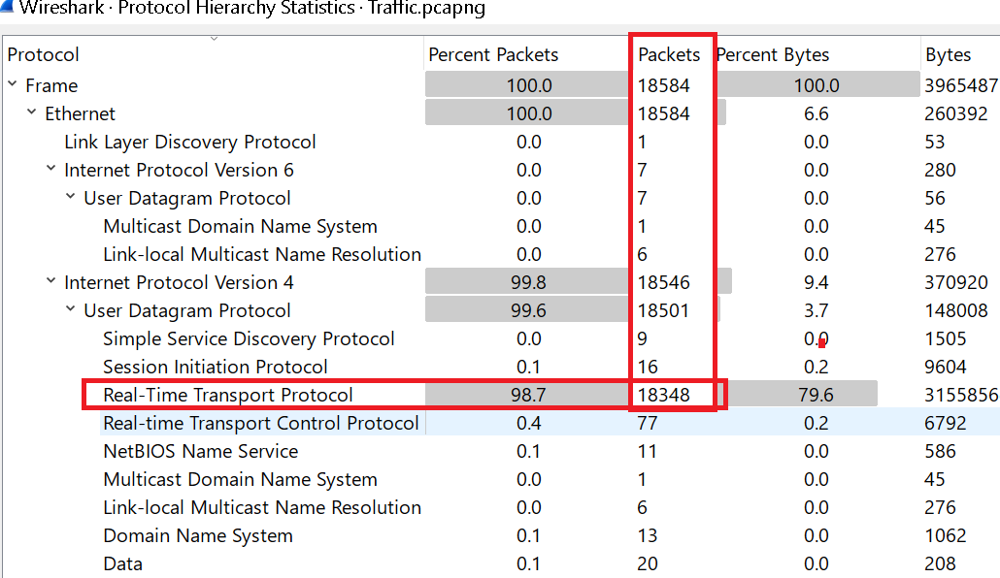
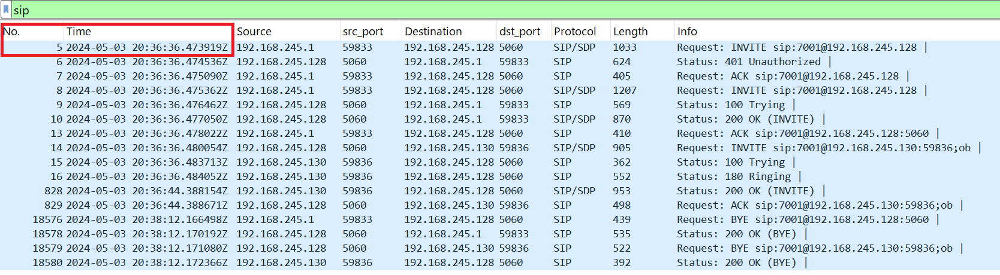
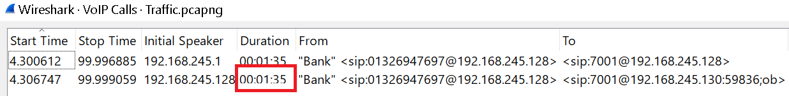
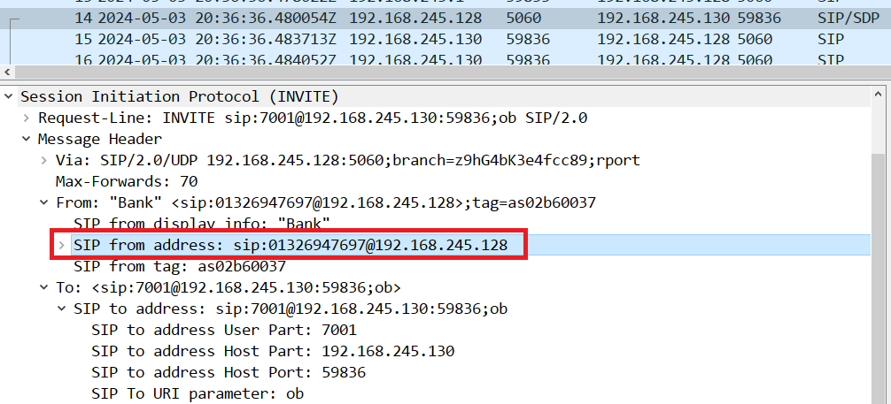
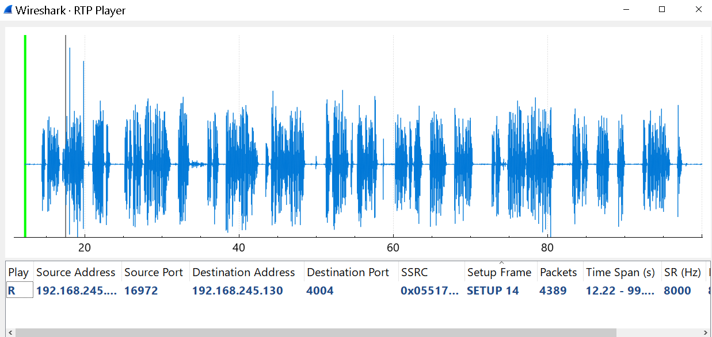

**Scenario: Your close friend James recently received a suspicious phone call from someone claiming to be his bank. The caller asked for sensitive information, making James uneasy. Suspecting a potential Vishing (Voice Phishing) attack, you decide to investigate by capturing and analyzing the VoIP traffic.**

Para este lab se nos da un solo archivo `.pcapng`, así que pasamos rápido a las preguntas

----------

**1\. How many RTP packets were in the traffic?**

Podemos verlo en la sección de `statistics`:



-------------

**2\. When did the fake call with James start?Answer Format: YYYY-MM-DD HH:MM:SS (UTC)**

Para esto filtramos por el protocolo `SIP`:

Este es el protocolo de señalización, encargado de establecer, modificar y terminar sesiones. Corre típicamente por UDP/TCP 5060 (5061 si es TLS). Es texto plano, parecido a HTTP en su estructura (request/response con headers). Los métodos que veremos todo el tiempo son:

- `REGISTER` — el endpoint se registra contra el servidor/proxy SIP
- `INVITE` — inicia una llamada
- `ACK`, `BYE`, `CANCEL` — control de la sesión
- `OPTIONS` — capability discovery (muy usado también para "pinging" en reconocimiento)



El primer paquete(frame 5) nos indica la primer paquete de señalización.

-----------

**3\. What is the Jame's phone number?**

Esto lo vemos en campo Request-URI del mensaje SIP INVITE porque ese campo especifica el usuario o extensión al que se quiere establecer la llamada:

```txt
# En el frame 14 de la captura:
14 4.306747 192.168.245.128 5060 192.168.245.130 59836 SIP/SDP 905 Request: INVITE sip:7001@192.168.245.130:59836;ob```

--------------

**4\. How long was the call with the bank? Answer Format: HH:MM:SS**

Esto lo encontramos en `Telephony -> VoIP Calls`:



------------

**5\. What is the phone number of the bank that James received a call from?**

En el mismo paquete podemos verlo:



--------------

**6\. What is the name of the bank calling?**

Para este caso vamos a `Telephony → VoIP Calls`, seleccionamos la llamada, y desde ahí "Play Streams" suele encontrarlo igual porque usa el SDP para saber los puertos.



Podremos escuchar que mencionan al `Bank of Wealth`

--------

**7\. What is James's Social Number?**

Escuchando el audio, a James se le solicita su dirección y númer de seguridad social, el cual es `5678`.
