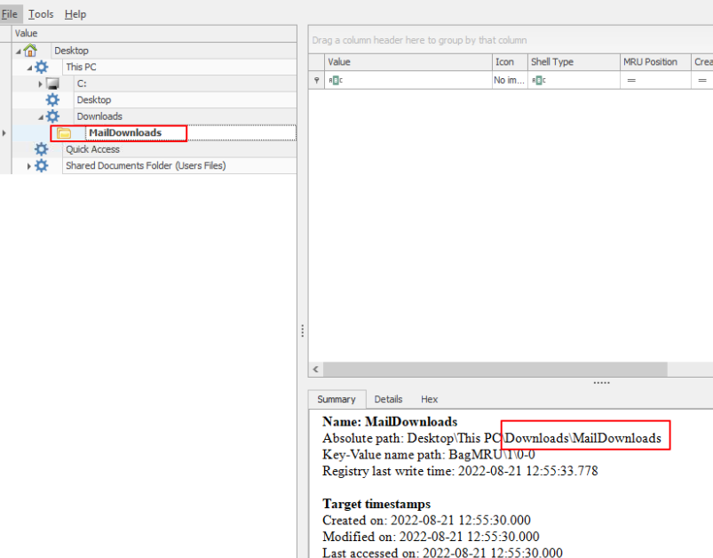
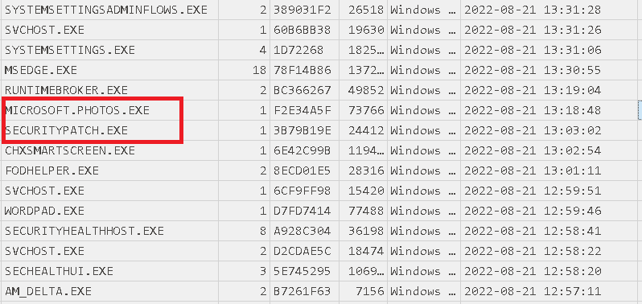
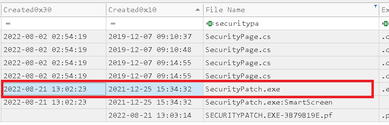
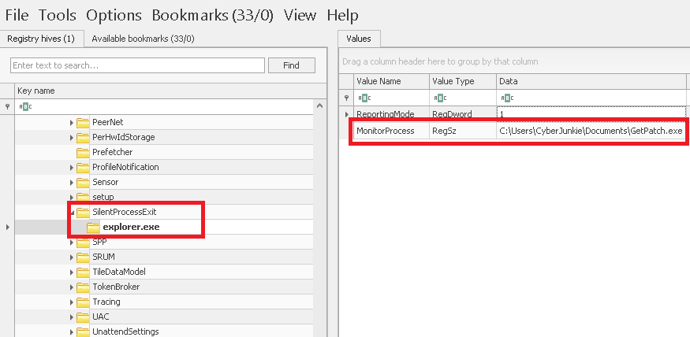
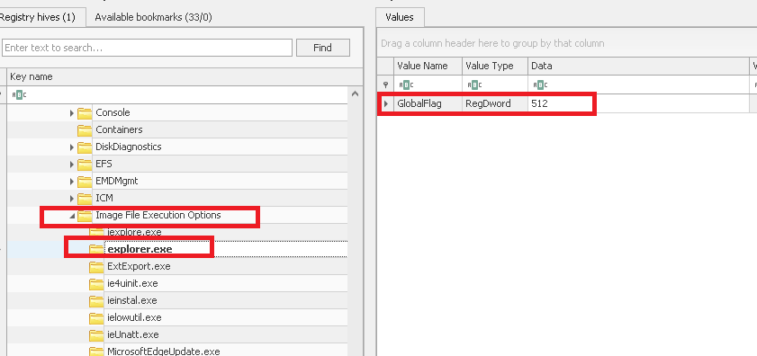
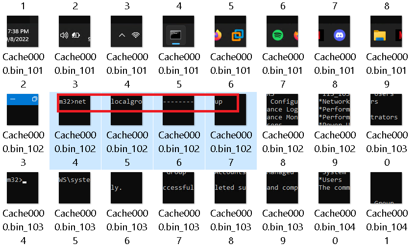
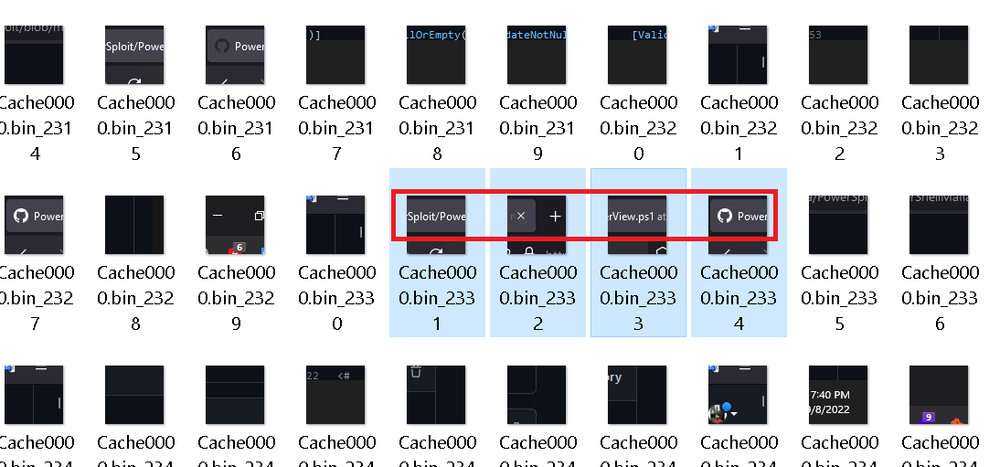

**Scenario: A targeted phishing campaign is carried out against our organization, and so far the phishing mail has been opened by 3 systems in our network. A quick triage image was collected from one of the infected systems and Provided to you for identification of TTP being used by attackers. Identify the Techniques and tactics used by the attacker so our incident response team can respond and mitigate any further compromises across the network.**

Para este lab se nos da un `.ad1`, por lo que vamos a montarlo con ´FTK Imager`.

---------

**1\. Initial Access was made through a Malicious Document delivered through email. What Was the full path where the document was downloaded?**

Después de montar en FTK tenemos que acceder al Registry de Windows, específicamente al Hive de usuario, donde encontraremos los shellbags, donde veremos el historial de carpetas/rutas navegadas por el usuario, estas Hives están en:

```txt
C:\Users\<USUARIO>\NTUSER.DAT
C:\Users\<USUARIO>\AppData\Local\Microsoft\Windows\UsrClass.dat
```


Abrimos `Shellbag explorer` y veremos la evidencia:



--------

**2\. What's the document name? (The document which was delivered via phishing)**

Para esto revisamos el `$Recycle.bin`, ya que el documento de phishing pudo haber sido descargado y posteriormente eliminado por el usuario, pero su rastro todavía puede quedar registrado en la papelera.
Cuando un archivo se elimina normalmente, Windows no lo borra inmediatamente. Lo mueve a $Recycle.Bin y conserva información que puede ser muy útil forensemente.

Usando `RBCmd.exe` de Zimmerman:

```powershell
PS C:\Users\User\Downloads\compartida\RBCmd> .\RBCmd.exe -f "C:\Users\User\tmp\RecycleBin\S-1-5-21-1187034906-4050784041-186213912-1001\IWKWHDC.docx"                                                                                       
RBCmd version 2026.5.0                                                                                                                                                                                                                          
Author: Eric Zimmerman (saericzimmerman@gmail.com)                                                                      
https://github.com/EricZimmerman/RBCmd                                                                                                                                                                                                          
Command line: -f C:\Users\User\tmp\RecycleBin\S-1-5-21-1187034906-4050784041-186213912-1001\IWKWHDC.docx              
Warning: Administrator privileges not found!                                                                                                                                                                                                    
Found 1 files. Processing...                                                                                                                                                                                                                    
Source file: C:\Users\User\tmp\RecycleBin\S-1-5-21-1187034906-4050784041-186213912-1001\IWKWHDC.docx                                                                                                                                          
Version: 2 (Windows 10/11)                                                                                              
File size: 12,411 (12.1KB)                                                                                              
File name: C:\Users\CyberJunkie\Downloads\MailDownloads\Security Awareness.docx                                         
Deleted on: 2022-08-21 08:03:33                                                                                                                                                                                                                                                                                                                                         
Processed 1 out of 1 files in 0.1701 seconds
```

Fue esto eliminado a las `2022-08-21 08:03:33`
--------

**3\. What's the stager name which connected to the attacker C2 server(Fullpath\name)**

El stager, como sugiere la pregunta, es el programa encargado en conectarse al C2 para recibir instrucciones, para rastrear esto tenemos que buscar en el Prefetch, que crea un registro para cada archivo ejecutado.
Parseamos el `Prefetch` y en TimeLine Explorer revisamos el .csv:



Vemos un par de nombres sospechosos, que están en el rango de tiempo cercano a la eliminación del archivo de la pregunta anterior.

---------

**4\. The attacker manipulated MACB Timestamps of the stager executable to confuse Analysts. Analyze the timestamps of the stager and verify the original timestamp and tampered one. (ORIGINAL TIMESTAMP : TAMPERED TIMESTAMP)**

Esto lo verificamos en la MFT, parseamos a .csv y filtramos por nombre:



----------

**5\. The attacker set up persistence by manipulating registry keys. All we know is that GlobalFlags image file technique was used to set up persistence. When exiting a certain process, the attacker persistence executable is executed. What's the name of that process?**

Esto lo encontraremos en la hive de `SOFTWARE` -> `HKLM\SOFTWARE` -> Config de software y del SO válida para todo el sistema.

Tanto IFEO (Image File Execution Options) como SilentProcessExit son mecanismos del sistema operativo. Los lee Windows sin importar qué usuario ejecute el proceso, así que están en `C:\Windows\System32\config\SOFTWARE`. Esto también nos dice algo del atacante: para escribir en HKLM necesitó privilegios de administrador.

**Es una función de depuración. Sirve para investigar por qué un proceso termina inesperadamente y sin crash, por ejemplo cuando un servicio "se muere solo" sin dejar rastros.**

### **Las configuraciones involucradas**:

a) `Image File Execution Options\<proceso.exe>`: aquí se activa el monitoreo con el valor `GlobalFlag`. Ese valor es un bitmask del NT Global Flag (lo que manipula la herramienta `gflags.exe`). El bit `0x200` (`FLG_MONITOR_SILENT_PROCESS_EXIT`) significa "vigila cuando este proceso salga".

b) `SilentProcessExit\<proceso.exe>`: aquí se configura qué hacer cuando ese proceso termina. Los valores principales son:

    - `ReportingMode`: bitmask. `0x1` lanza un proceso monitor, `0x2` genera un dump local, `0x4` manda una notificación.
    - `MonitorProcess`: ruta del ejecutable que se lanza al salir el proceso.
    - `LocalDumpFolder` y `DumpType`: dónde y cómo guardar el dump.

"Silent exit" significa que el proceso terminó por ExitProcess o TerminateProcess, es decir, sin crash. Windows lo detecta, y el que orquesta la reacción es WerFault.exe (Windows Error Reporting).

### **El ataque (MITRE T1546.012, variante SilentProcessExit)**

El atacante abusa exactamente de esa funcionalidad legítima:

    - Elige un proceso "víctima" (idealmente uno que el usuario abre y cierra con frecuencia).
    - Activa GlobalFlag = 0x200 en IFEO\<victima.exe>.
    - Crea SilentProcessExit\<victima.exe> con ReportingMode = 1 y en MonitorProcess pone la ruta de su ejecutable malicioso.
    - Cada vez que la víctima termina, Windows lanza el payload.

### **Esto quedaría así**:

```bash
HKLM\SOFTWARE\Microsoft\Windows NT\CurrentVersion\Image File Execution Options\notepad.exe
    GlobalFlag = 0x200          ← activa el monitoreo

HKLM\SOFTWARE\Microsoft\Windows NT\CurrentVersion\SilentProcessExit\notepad.exe
    ReportingMode = 1           ← "lanza un proceso monitor"
    MonitorProcess = C:\ruta\malware.exe   ← qué se ejecuta
```

**Esto es muy atractivo por**:

- No usa las ubicaciones clásicas (Run keys, Scheduled Tasks, servicios), que son las primeras que revisa cualquier analista.
- El payload aparece como hijo de WerFault.exe, lo cual parece tráfico "normal" de errores de Windows si nadie mira con detalle.
- El trigger es el cierre del proceso, no el inicio, algo poco intuitivo.

Entonces, explorando esto en Registry Hive:



> Vemos la configuración para `explorer.exe`, con `C:\Users\CyberJunkie\Documents\GetPatch.exe` configurado, verificamos en `Image File Execution Options`:



----------

**6\. Whats the full path alongside name of the executable which is setup for persistence?(FULLPATH\Filename)**

En la pregunta anterior vimos que `explorer.exe` tenía configurado `C:\Users\CyberJunkie\Documents\GetPatch.exe`.

----------

**7\. The attacker logged in via RDP and then performed lateral Movement. Attacker accessed an Internal network-connected Device via RDP. What command was run on cmd after successful RDP into Other Windows machine?**

Cuando uno se conecta por RDP con `mstsc.exe`, el cliente no descarga la pantalla completa en cada frame. Para ahorrar ancho de banda, el servidor manda pequeños fragmentos de imagen (tiles) y el cliente los guarda en caché en disco para reutilizarlos si esa parte de la pantalla se repite (un icono, una barra de título, un trozo de texto).

Esa caché queda en la máquina desde la que se origina la conexión:

```bash
C:\Users\<usuario>\AppData\Local\Microsoft\Terminal Server Client\Cache\
```

Los formatos son:

    - `Cache0000.bin`, `Cache0001.bin...` en Windows 7 y posteriores
    - `bcache24.bmc` en versiones antiguas

Para analizar estas evidencias forenses usaremos `bmc-tools`, los `.bin` y `.bmc` son contenedores binarios con muchos tiles concatenados, no se pueden abrir como imagen. bmc-tools los parsea y extrae cada tile como un archivo .bmp individual.

Obtenemos la herramienta de "https://github.com/ANSSI-FR/bmc-tools", es un script de python, lo ejecutamos y podremos navegar entre los `.bmp`, y entre todos podremos ver el comando:



---------

**8\. The attacker tried to download a tool from the user's browser in that second machine. What's the tool name? (name.ext)**

Al igual que la pregunta anterior, navegando entre los `.bmp` veremos los siguiente:



`PowerView.ps1` es una script de reconocimiento y enumeración para entornos de Active directory.

---------------

**9\. What command was executed which resulted in privilege escalation?**

Para esto usaremos `DeepBlue.ps1`, un script de PowerShell de Eric Conrad (SANS, repo sans-blue-team/DeepBlueCLI) para threat hunting sobre logs de eventos de Windows. Le pasas un .evtx (o le dices que lea el log en vivo) y aplica reglas de detección para marcar eventos sospechosos, así no revisas miles de eventos a mano en el Event Viewer. 

Ejecutando:


**Expliquemos esto.**

Cada proceso e hilo en Windows lleva un token de acceso, que es su "credencial": dice quién eres (usuario/SID), a qué grupos perteneces y qué privilegios tienes. Cuando intentas abrir un archivo o un proceso, Windows revisa tu token, no tu nombre.

El truco es que Windows permite que un servidor de named pipe "suplante" temporalmente a su cliente con `ImpersonateNamedPipeClient()`. Es una función legítima: si un servicio de impresión recibe un pedido de un usuario, debe acceder a archivos con los permisos de ese usuario, no con los suyos.

Entonces el atacante no necesita "hackear" nada. **Solo necesita conseguir que un proceso SYSTEM se conecte como cliente a un pipe que él controla.**

```txt
Atacante (admin, Meterpreter)          Windows (SCM)
─────────────────────────────          ─────────────────────
1. Crea pipe \\.\pipe\kyvckn
   y espera (es el SERVIDOR)
2. Crea el servicio con ImagePath
   "cmd /c echo kyvckn > \\.\pipe\kyvckn"
3. Inicia el servicio ───────────────► 4. SCM lanza cmd.exe como SYSTEM
                                       5. cmd intenta escribir al pipe
                                          (es el CLIENTE, con token SYSTEM)
6. Recibe la conexión
7. Llama ImpersonateNamedPipeClient
   → su hilo ahora tiene token SYSTEM
8. Duplica el token y lo usa para
   lanzar procesos como SYSTEM
9. Borra el servicio
```

El `echo` no importa. Sirve como excusa para que un proceso SYSTEM toque el pipe. Podría escribir cualquier cosa.

Ojo, el atacante pone el servidor y Windows pone al cliente SYSTEM sin darse cuenta. Por eso funciona: nadie explota una vulnerabilidad, se abusa del diseño.

#### **Y Dónde entra Active Directory?**

Cuando un proceso SYSTEM se autentica en la red, lo hace como la cuenta de máquina (`NOMBREPC$`). En un dominio, esa cuenta es un principal más de AD con sus propios permisos. Por eso tener SYSTEM en un equipo unido al dominio te da una identidad válida en AD para enumerar, y es un paso previo típico al movimiento lateral. Pero la escalada en sí sigue siendo local.

Algo a considerar es que esta escalada es de Administrador → SYSTEM, no de usuario normal a admin. Para crear el servicio hace falta ser admin, y por eso la técnica exige que el atacante ya tenga esa cuenta.

----------

**10\. What framework was used by the attacker?**

En la imagen de la pregunta anterior vemos que se trata del bien conocido `Metasploit`.
