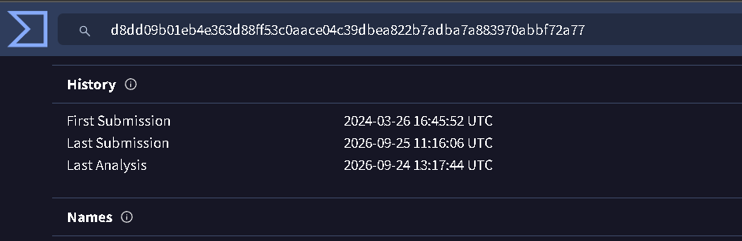

**Scenario: In the afternoon, network monitoring systems detected anomalous traffic patterns originating from a critical transaction processing server. Initial signs suggest a potential security breach. You have been provided with a forensic image of the affected system and tasked with conducting a thorough investigation to determine the scope of the incident.**

Para este laboratorio se nos dan los siguientes ficheros:

```bash
┌──(kali㉿kali)-[~/Documents/nueva_era_sherlocks/kernelexploit]
└─$ ls
 bodyfile   chkrootkit   hash_executables   live_response  '[root]'   uac.log   uac.log.stderr
```

Asì que pasamos rápidamente a las preguntas.

---------

**1\. What is the name of the key file the intruder downloaded to elevate their privileges after gaining unauthorized access?**

Para investigar esto podemos empezar revisando la lista de ejecutables en `hash_executables/list_of_executable_files.txt`, con el siguiente filtro buscamos por las rutas más comunes en las que un atacante suele alojar malware:

```bash
┌──(kali㉿kali)-[~/Documents/nueva_era_sherlocks/kernelexploit]
└─$ grep -E '^/(tmp|var/tmp|dev/shm|home|root)/' hash_executables/list_of_executable_files.txt
/tmp/exploit
```

-------

**2\. When was the file used for privilege escalation first submitted on Virus Total?**

Buscando el hash del ejecutable:

```bash
┌──(kali㉿kali)-[~/Documents/nueva_era_sherlocks/kernelexploit]
└─$ grep -i "exploit" hash_executables/hash_executables.sha1 
27ecf910a5f4a1d21c22f8bfa5e6dc50d24acece  /tmp/exploit
```

Y buscando en virustotal por este hash:



-----

**3\. What is the Process ID (PID) of the operation launched by the attacker?**

Buscando en los procesos:

```bash
┌──(kali㉿kali)-[~/Documents/nueva_era_sherlocks/kernelexploit]
└─$ cat live_response/process/ps_auxwww.txt | grep exploit
a1l4m      31671  0.3  0.9 133464 64640 pts/0    S    10:03   0:00 ./exploit
```

----------

**4\. What username was the malicious process running under?**

En la pregunta anterior vemos que se hace bajo el usuario `a1l4m`.

--------

**5\. What is the Parent Process ID (PPID) associated with the malicious process?**

Buscando en el `ps -ef`:

```bash
┌──(kali㉿kali)-[~/Documents/nueva_era_sherlocks/kernelexploit]
└─$ grep -i "exploit" live_response/process/ps_-ef.txt
a1l4m      31671    1686  0 10:03 pts/0    00:00:00 ./exploit
```

-----------

**6\. What are the operating system and its version on the compromised server?Answer Format:version-os**

Buscando en la info proporcionada del servidor: 

```bash
                                                                                                                                                                                            
┌──(kali㉿kali)-[~/Documents/nueva_era_sherlocks/kernelexploit]
└─$ cat live_response/system/uname_-a.txt 
Linux a1l4m 6.5.0-27-generic #28~22.04.1-Ubuntu SMP PREEMPT_DYNAMIC Fri Mar 15 10:51:06 UTC 2 x86_64 x86_64 x86_64 GNU/Linux
```

-----------

**7\. What is the kernel version of the compromised system?**

En la información del sistema presentada en la pregunta anterior vemos que se trata de la versión del kernel `6.5.0-27-generic`.

------

**8\. What is the most recent CVE number associated with the vulnerabilities exploited in this attack?**

Buscando en internet con `linux kernel 6.5.0-27-generic cve`
 

