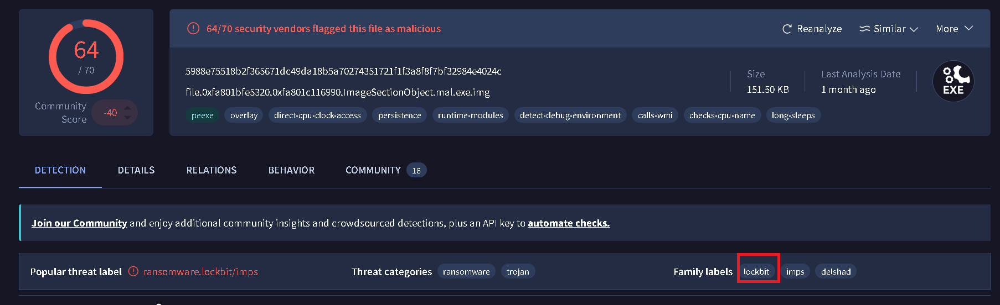
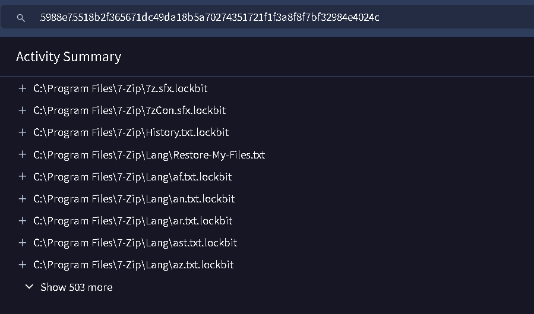
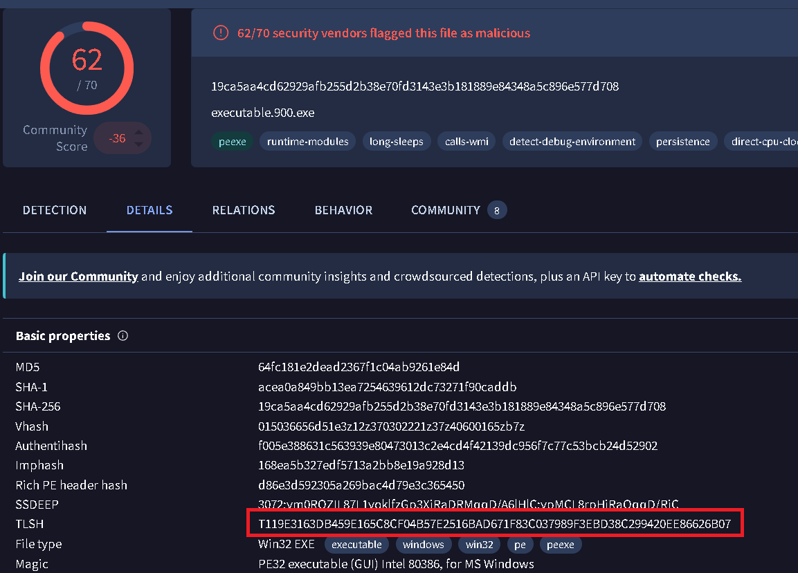
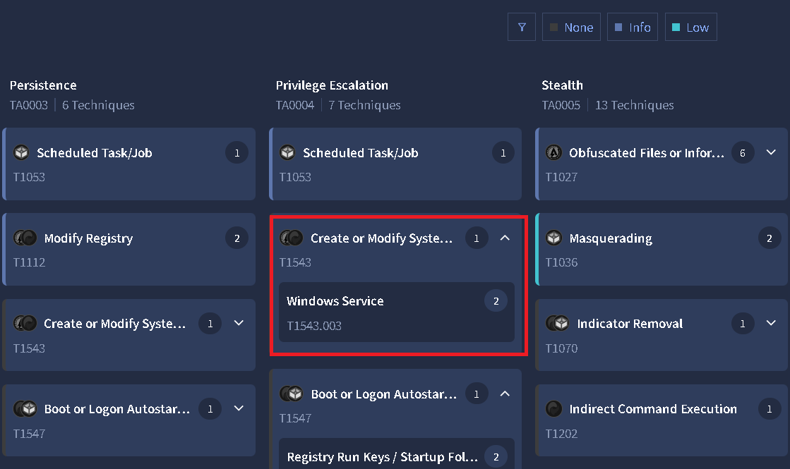
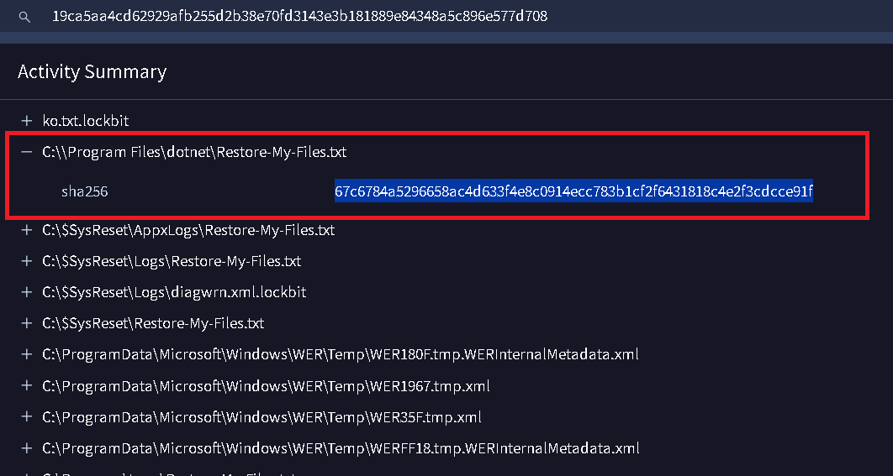
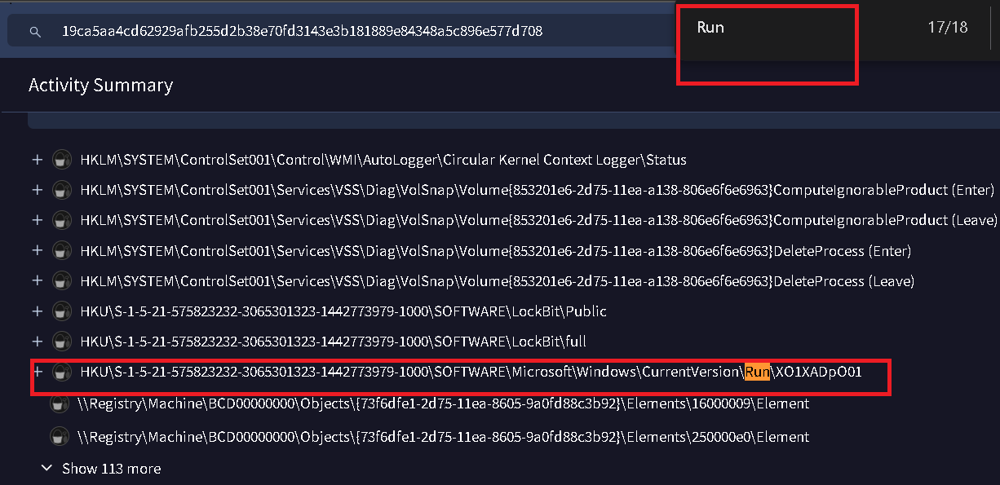

**Scenario: You are a Digital Forensics and Incident Response (DFIR) analyst tasked with investigating a ransomware attack that has affected a company's system. The attack has resulted in file encryption, and the attackers are demanding payment for the decryption of the affected files. You have been given a memory dump of the affected system to analyze and provide answers to specific questions related to the attack.**

--------

Para este laboratorio nos dan un solo fichero, una extracción de memoria:

```bash
┌──(kali㉿kali)-[~/Documents/nueva_era_sherlocks/lockbit]
└─$ file Lockbit.vmem 
Lockbit.vmem: data
```

Así que pasamos rápido a las preguntas.

--------

**1\. Can you determine the date and time that the device was infected with the malware? (UTC, format: YYYY-MM-DD hh:mm:ss)**

Primero empezamos obteniendo la información del sistema, siempre es importante empezar con esto para seguir una metodología bien definida:

```bash
┌──(kali㉿kali)-[~/Documents/nueva_era_sherlocks/lockbit]
└─$ python3 ~/blue-labs/volatility3/vol.py -f Lockbit.vmem windows.info
Volatility 3 Framework 2.26.2
WARNING  volatility3.framework.layers.vmware: No metadata file found alongside VMEM file. A VMSS or VMSN file may be required to correctly process a VMEM file. These should be placed in the same directory with the same file name, e.g. Lockbit.vmem and Lockbit.vmss.
Progress:  100.00               PDB scanning finished                                                                                              
Variable        Value

Kernel Base     0xf80002a18000
DTB     0x187000
Symbols file:///home/kali/blue-labs/volatility3/volatility3/symbols/windows/ntkrnlmp.pdb/25F4F1A66D0C4385902C9414E61870A2-1.json.xz
Is64Bit True
IsPAE   False
layer_name      0 WindowsIntel32e
memory_layer    1 FileLayer
KdDebuggerDataBlock     0xf80002bfb130
NTBuildLab      7601.26111.amd64fre.win7sp1_ldr_
CSDVersion      1
KdVersionBlock  0xf80002bfb0e8
Major/Minor     15.7601
MachineType     34404
KeNumberProcessors      2
SystemTime      2023-04-13 10:07:08+00:00
NtSystemRoot    C:\Windows
NtProductType   NtProductWinNt
NtMajorVersion  6
NtMinorVersion  1
PE MajorOperatingSystemVersion  6
PE MinorOperatingSystemVersion  1
PE Machine      34404
PE TimeDateStamp        Tue Aug  9 03:04:25 2022
```

Ahora obtenemos la lista de procesos:

```bash
┌──(kali㉿kali)-[~/Documents/nueva_era_sherlocks/lockbit]
└─$ python3 ~/blue-labs/volatility3/vol.py -f Lockbit.vmem windows.pslist > windows.pslist
<SNIP>
900     216     mal.exe 0xfa8018fccb00  267     1254    1       True    2023-04-13 10:06:45.000000 UTC  N/A     Disabled
<SNIP>
```

Esta línea es la más sospechosa, el propio nombre lo delata, buscando por el `PPID` en el `pstree`:

-----

**2\. What is the name of the ransomware family responsible for the attack?**

Para respondera esto tenemos que extraer los ficheros relacionados con este proceso:

```bash
┌──(kali㉿kali)-[~/Documents/nueva_era_sherlocks/lockbit/dumpfile]
└─$ python3 ~/blue-labs/volatility3/vol.py -f ../Lockbit.vmem windows.dumpfiles --pid 900
```

Y buscando por el nombre queya identificamos:

```bash
┌──(kali㉿kali)-[~/Documents/nueva_era_sherlocks/lockbit/dumpfile]
└─$ find . -name "*mal*"
./file.0xfa801bfe5320.0xfa801c116990.ImageSectionObject.mal.exe.img
./file.0xfa801bfe5320.0xfa801bde2b10.DataSectionObject.mal.exe.dat
```

- El `.img` representa la sección de imagen ejecutable que Windows creó cuando cargó mal.exe en memoria. En pocas palabras, es la representación del PE (Portable Executable) mapeada como imagen en memoria.
- El `.dat` es otra representación de la sección del archivo que Windows mantiene como sección de datos/cache del archivo. No necesariamente es un PE ejecutable completo.

Por lo que nos interesa el `.img`: 

```bash
┌──(kali㉿kali)-[~/Documents/nueva_era_sherlocks/lockbit/dumpfile]
└─$ sha256sum file.0xfa801bfe5320.0xfa801c116990.ImageSectionObject.mal.exe.img                        
5988e75518b2f365671dc49da18b5a70274351721f1f3a8f8f7bf32984e4024c  file.0xfa801bfe5320.0xfa801c116990.ImageSectionObject.mal.exe.img
```

Subiendo el hash a virus total:



Pertenece a la familia de malware `Lockbit`, una peligrosa familia de ransomware surgida en 2019 como servicio de **Ransomware As A Service**.

-----------

**3\. What file extension is appended to the encrypted files by the ransomware?**

Revisando en virus total en la sección de `Files Written`:



Para confirmar podemos usar el plugin `windows.filescan`:

```bash
┌──(.venv)─(kali㉿kali)-[~/Documents/nueva_era_sherlocks/lockbit]
└─$ python3 ~/blue-labs/volatility3/vol.py -f Lockbit.vmem windows.filescan | grep -i "\.lockbit"
WARNING  volatility3.framework.layers.vmware: No metadata file found alongside VMEM file. A VMSS or VMSN file may be required to correctly process a VMEM file. These should be placed in the same directory with the same file name, e.g. Lockbit.vmem and Lockbit.vmss.
0x278e9430 100.0\Program Files\DVD Maker\Shared\DvdStyles\HueCycle\NavigationUp_ButtonGraphic.png.lockbit
0x28bd6950      \Program Files\DVD Maker\Shared\DvdStyles\HueCycle\NavigationRight_ButtonGraphic.png.lockbit
0x28dcff20      \Program Files\DVD Maker\Shared\DvdStyles\Performance\whitemenu.png.lockbit
0x28f645a0      \Program Files (x86)\Windows Sidebar\Gadgets\CPU.Gadget\images\dial.png.lockbit
0x28fb76e0      \Program Files\DVD Maker\Shared\DvdStyles\LayeredTitles\1047x576black.png.lockbit
0x29034ae0      \Program Files\DVD Maker\Shared\DvdStyles\BabyBoy\MainMenuButtonIcon.png.lockbit
0x29549320      \Program Files\DVD Maker\Shared\DvdStyles\BabyBoy\nav_leftarrow.png.lockbit
0x29c40510      \Program Files\DVD Maker\Shared\DvdStyles\Memories\btn-previous-static.png.lockbit
0x7ca04ab0      \Program Files\DVD Maker\Shared\DvdStyles\Full\full.png.lockbit
0x7ca0d750      \Program Files\Windows Sidebar\Gadgets\CPU.Gadget\images\glass_lrg.png.lockbit
0x7ca0da10      \Program Files\Windows Sidebar\Gadgets\PicturePuzzle.Gadget\Images\11.png.lockbit
0x7ca5c070      \Program Files\DVD Maker\Shared\DvdStyles\Full\dotsdarkoverlay.png.lockbit
0x7ca7e3a0      \Program Files\DVD Maker\Shared\DvdStyles\BabyBoy\babyblue.png.lockbit
0x7ca89c80      \Program Files\DVD Maker\Shared\DvdStyles\circleround_glass.png.lockbit
0x7cafde20      \Program Files\DVD Maker\Shared\DvdStyles\Stacking\NavigationUp_SelectionSubpicture.png.lockbit
0x7cb83b70      \Program Files\DVD Maker\Shared\DvdStyles\OldAge\15x15dot.png.lockbit
0x7cb83cc0      \Program Files\DVD Maker\Shared\DvdStyles\HueCycle\NavigationRight_SelectionSubpicture.png.lockbit
```

------

**4\. What is the TLSH (Trend Micro Locality Sensitive Hash) of the ransomware?**

Si intentamos poner el hash del ejecutable que extrajimos con ´volatility3´ veremos que no es la respuesta correcta, esto se debe a cómo volatility maneja la reconstrucción del PE.

Cuando Windows carga un ejecutable (.exe/.dll) en memoria, no lo mapea igual que como está en disco. Hay dos conceptos clave en el header de un PE:

`FileAlignment`: cómo están alineadas las secciones en el archivo en disco (normalmente 512 bytes).
`SectionAlignment`: cómo están alineadas esas mismas secciones una vez cargadas en memoria (normalmente 4096 bytes, el tamaño de una página).

Esto significa que, en memoria, las secciones tienen padding y offsets distintos a los que tendría el archivo original en disco. Si dumpeamos "tal cual" lo que hay en memoria, obtenemos una imagen que no es binariamente idéntica al archivo original, aunque contenga el mismo código.

El plugin `dumpfiles` de Vol3 extrae los `MemoryMappedFile`/`ImageSectionObject` tal como están en memoria: respeta el `SectionAlignment`, no el `FileAlignment`. Es decir, nos da el layout de memoria, no el layout de disco. El resultado es un archivo con la estructura "correcta" en cuanto a contenido, pero con un byte-a-byte diferente al binario original (gaps de padding distintos, offsets de sección distintos, etc.).

Como TLSH es un hash de similitud (fuzzy hash) que trabaja sobre la distribución de bytes del archivo, esos cambios estructurales, aunque el código "lógico" sea el mismo, son suficientes para generarnos un TLSH completamente distinto al que tiene VirusTotal (que fue calculado sobre el binario original en disco).

Volatility2 tiene el plugin `procdump` (para dumpear el ejecutable de un proceso), y a diferencia de `dumpfiles` en Vol3, este plugin hace una reconstrucción activa: recorre las secciones tal como están en memoria y las realinea al formato de disco, ajustando los offsets según el `FileAlignment` original del header PE. Básicamente reconstruye el PE para que quede estructuralmente equivalente al binario que existía en disco antes de ejecutarse.

Esa reconstrucción es la que hace que el TLSH coincida con el reportado en VirusTotal, porque ahora sí se está comparando "manzanas con manzanas": binario reconstruido vs binario original en disco.

Empezamos obteniendo el `profile` correcto para volatility2(esto es obligatorio a diferencia de Vol3 que auto-detecta):

```bash
┌──(.venv)─(kali㉿kali)-[~/Documents/nueva_era_sherlocks/lockbit]
└─$ python2 ~/blue-labs/volatility/vol.py -f Lockbit.vmem imageinfo
Volatility Foundation Volatility Framework 2.6.1
INFO    : volatility.debug    : Determining profile based on KDBG search...
          Suggested Profile(s) : Win7SP1x64, Win7SP0x64, Win2008R2SP0x64, Win2008R2SP1x64_24000, Win2008R2SP1x64_23418, Win2008R2SP1x64, Win7SP1x64_24000, Win7SP1x64_23418
                     AS Layer1 : WindowsAMD64PagedMemory (Kernel AS)
                     AS Layer2 : FileAddressSpace (/home/kali/Documents/nueva_era_sherlocks/lockbit/Lockbit.vmem)
                      PAE type : No PAE
                           DTB : 0x187000L
                          KDBG : 0xf80002bfb130L
          Number of Processors : 2
     Image Type (Service Pack) : 1
                KPCR for CPU 0 : 0xfffff80002bfd000L
                KPCR for CPU 1 : 0xfffff88002f00000L
             KUSER_SHARED_DATA : 0xfffff78000000000L
           Image date and time : 2023-04-13 10:07:08 UTC+0000
     Image local date and time : 2023-04-13 03:07:08 -0700
```

Usando `Win7SP1x64`, y con el PID ya identificado, obtenemos el ejecutable:

```bash
┌──(kali㉿kali)-[~/Documents/nueva_era_sherlocks/lockbit]
└─$ python2 ~/blue-labs/volatility/vol.py -f Lockbit.vmem --profile=Win7SP1x64 procdump --pid=900 --dump-dir=_procdump
Volatility Foundation Volatility Framework 2.6.1
Process(V)         ImageBase          Name                 Result
------------------ ------------------ -------------------- ------
0xfffffa8018fccb00 0x0000000000400000 mal.exe              OK: executable.900.exe
```



----------

**5\. Which MITRE ATT&CK technique ID was used by the ransomware to perform privilege escalation?**

En esta página de virustotal vamos a la sección de `Behavior -> MITRE ATT&CK Tactics and Techniques`



------------

**6\. What is the SHA256 hash of the ransom note dropped by the malware?**

En la sección de `Files Dropped` en virustotal  podemos ver `Restore-My-Files.txt`:



Podemos confirmar su presencia con el plugin `mftparser` de `Vol2`:

```bash
┌──(kali㉿kali)-[~/Documents/nueva_era_sherlocks/lockbit]
└─$ python2 ~/blue-labs/volatility/vol.py -f Lockbit.vmem --profile=Win7SP1x64 mftparser | grep -i "restore"
Volatility Foundation Volatility Framework 2.6.1
<SNIP>
2023-04-13 10:06:54 UTC+0000 2023-04-13 10:06:54 UTC+0000   2023-04-13 10:06:54 UTC+0000   2023-04-13 10:06:54 UTC+0000   ProgramData\VMware\VMware VGAuth\MSGCAT~1\messages\ko\Restore-My-Files.txt
2023-04-13 10:06:54 UTC+0000 2023-04-13 10:06:54 UTC+0000   2023-04-13 10:06:54 UTC+0000   2023-04-13 10:06:54 UTC+0000   ProgramData\VMware\VMware VGAuth\MSGCAT~1\messages\ja\Restore-My-Files.txt
2023-04-13 10:06:54 UTC+0000 2023-04-13 10:06:54 UTC+0000   2023-04-13 10:06:54 UTC+0000   2023-04-13 10:06:54 UTC+0000   ProgramData\VMware\VMware VGAuth\MSGCAT~1\messages\zh_TW\Restore-My-Files.txt
2023-04-13 10:06:54 UTC+0000 2023-04-13 10:06:54 UTC+0000   2023-04-13 10:06:54 UTC+0000   2023-04-13 10:06:54 UTC+0000   ProgramData\VMware\VMWARE~1\en-US\Restore-My-Files.txt
```

---------

**7\. What is the name of the registry key edited by the ransomware during the attack to apply persistence on the infected system?**

Esto es un comportamiento típico, se editan las claves:

```bash
HKEY_LOCAL_MACHINE\Software\Microsoft\Windows\CurrentVersion\Run
HKEY_LOCAL_MACHINE\Software\Microsoft\Windows\CurrentVersion\RunOnce

HKEY_CURRENT_USER\Software\Microsoft\Windows\CurrentVersion\Run
HKEY_CURRENT_USER\Software\Microsoft\Windows\CurrentVersion\RunOnce
```

Buscando en el reporte de VirusTotal confirmamos esto:


