---------------

**Sherlock Scenario: An engineer in the software development team has noticed an unusual spike in traffic to one of the organization’s critical Ray AI cluster APIs. The traffic pattern does not match typical usage and raises concerns about possible unauthorized access or a potential security breach. The Ray server, responsible for artificial intelligence and machine learning tasks, has been exposed to the external network, and the sudden surge in requests suggests that an attacker may be attempting to exploit vulnerabilities within the AI cluster.**

------------

Para este laboratorio se nos da un solo fichero `.pcap` que analizaremos con wireshark, con esto podemos pasar rápido a las preguntas.

--------

**1\. Which software framework was active on the server at the time of the incident?**

Para esto podemos filtrar por la palabra ´framework´ para buscar entre los paquetes:

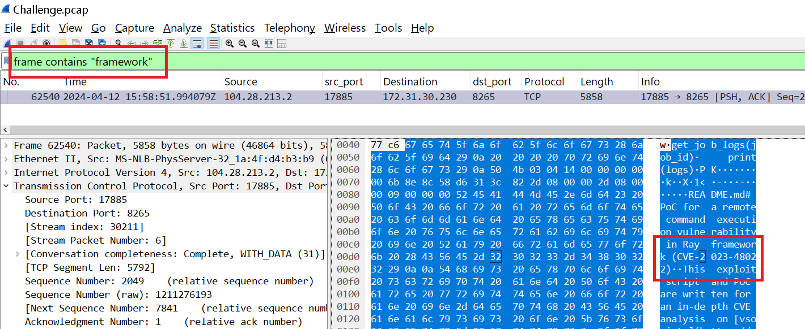

-------

**2\. What version of the software framework was installed on the compromised system?**

La API suele exponer una ruta para consultar la versión de la misma, generalmente en ´/api/version´:

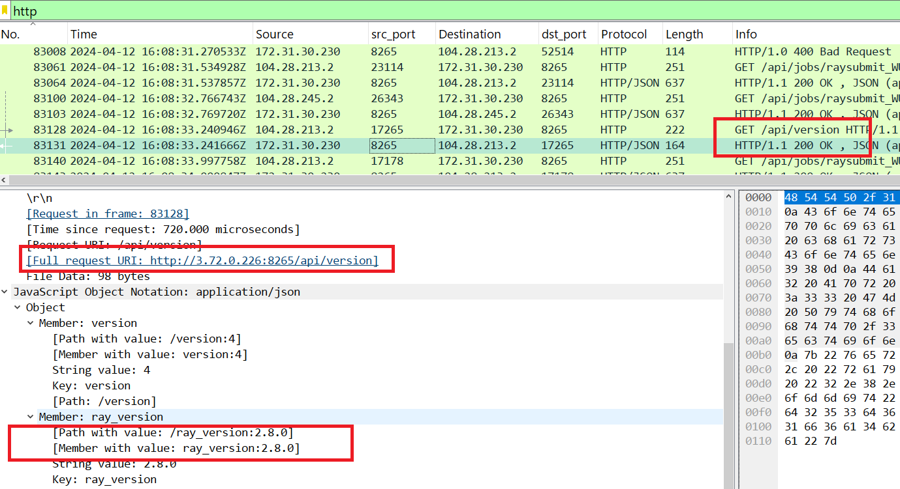

Vemos que en efecto se hicieron peticiones ´GET´ a dicho endpoit.

---------

**3\. What is the public IP address and port number on which the framework service was accessible during the incident?**

En la pregunta anterior, en la llamada a la API, vemos que la petición total es hacia: `3.72.0.226:8265`

**Esto que vemos es NAT**

- 172.31.30.230 es la IP privada (RFC 1918) del servidor. El rango 172.31.0.0/16 es el CIDR de la VPC por defecto en AWS.
- 3.72.0.226 es la IP pública de esa misma instancia. Es un rango de AWS, y en la nube esa IP pública se asigna a la instancia (auto-assigned o Elastic IP).
- 104.28.213.2 es el cliente que hace las peticiones, y es tráfico que viene de Internet.

**Así es como funciona**:

    - El cliente escribe en su herramienta http://3.72.0.226:8265/api/version, así que esa es la IP pública que conoce.
    - El paquete llega al Internet Gateway de AWS, que hace un NAT 1:1 y cambia el destino de 3.72.0.226 a 172.31.30.230.
    - La captura se hizo dentro de la instancia, así que en la capa IP ves la IP privada.
    - La cabecera HTTP Host: viaja dentro del payload y el NAT no la toca. Conserva lo que el cliente puso: 3.72.0.226:8265.

------------

**4\ Among several IP addresses flagged for suspicious activity, one repeatedly attempted to exploit the system's vulnerabilities. What is the IP address of this persistent attacker?**

Ahora que ya conocemos la versión del servicio, Ray 2.8.0, podemos buscar las vulnerabilidades del mismo: Con el Dashboard/Jobs API en el puerto 8265 expuesto a Internet es el escenario de ShadowRay (CVE-2023-48022). Esa API no tiene autenticación por defecto, y un `POST /api/jobs/` permite ejecutar comandos arbitrarios en el cluster. Los `raysubmit_...` que aparecen en los GET son IDs de jobs enviados.

Primero filtramos por los `POST` a este enpoint con `http.request.method == "POST" && http.request.uri contains "/api/jobs"`

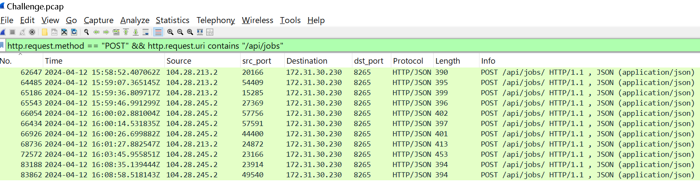

Solo por conteo, 104.28.245.2 es la candidata: 7 vs 4. Además su actividad se extiende más en el tiempo (de 15:59:46 hasta 16:08:58), mientras que la otra IP se concentra entre 15:58 y 16:01.

Aunque podríamos afirmar que se trata del mismo atacante, ya que ambas IP comparten el mismo `User-Agent: python-requests/2.31.0`, el mismo hash de paquete: `"working_dir": "gcs://_ray_pkg_bf19252c1fb036e5.zip"` y el mismo rango ASN(ese /16 es de Cloudflare)

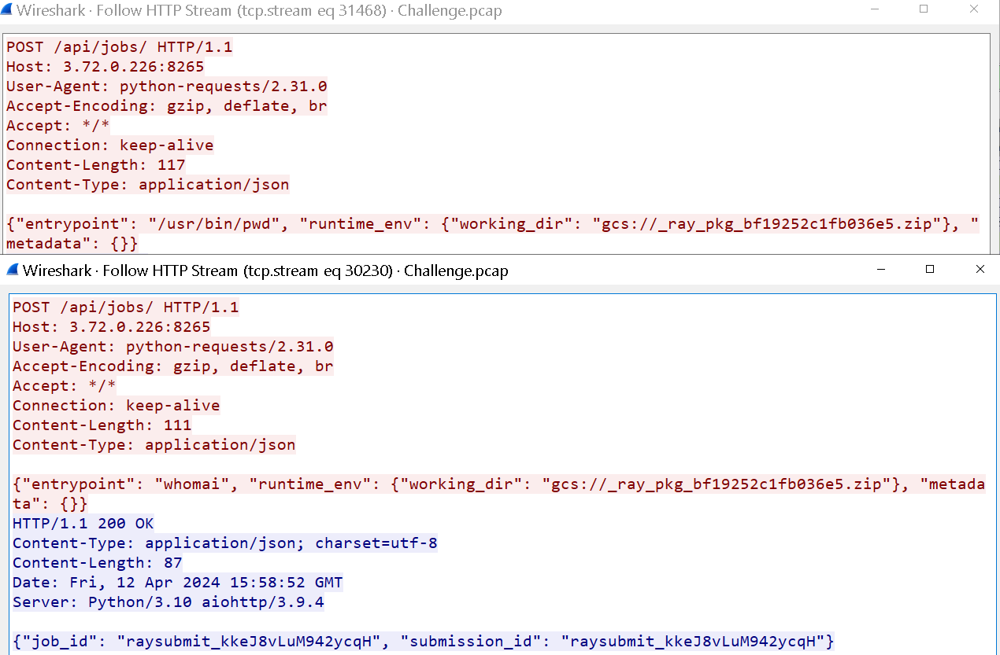

---------

**5\. What is the timestamp of the first recorded interaction between the attacker’s IP address and the victim machine?**

Filtramos por la IP y ordenamos por la columna de tiempo:

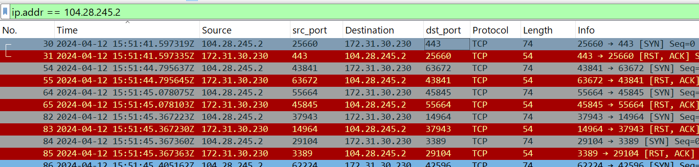

-----------

**6\. What is the first job submission ID that was created due to the attacker's actions?**

Aplicamos el siguiente filtro en wireshak, como ya vimos, parece ser que se trata del mismo atacante:

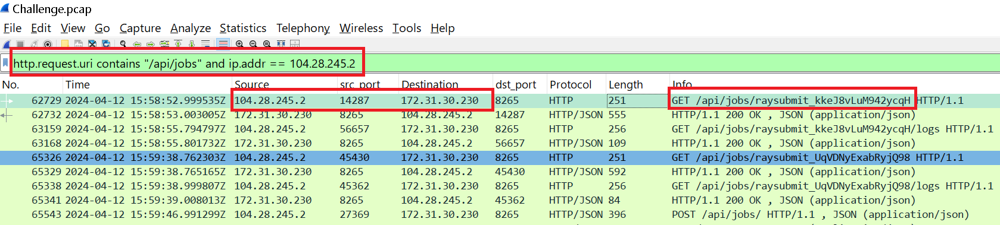

------

**7\. What is the CVE number of the vulnerabilities exploited in this attack?**

Como ya mencionamos anteriormente, se trata del `CVE-2023-48022`

------------

**8\. Analyzing the attacker’s command execution can reveal their intentions. What was the command?**

Revisando el flujo HTTP del paquete identificado en la pregunta 6:

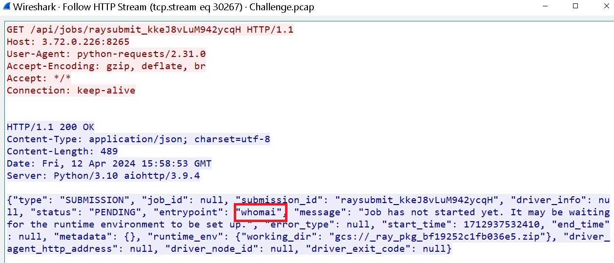

--------

**9\. Review the network traffic logs to find where the reverse shell was initiated. What IP address and port were used to establish the unauthorized access?(Answer Format: IP:Port)**

Revisando los POST:

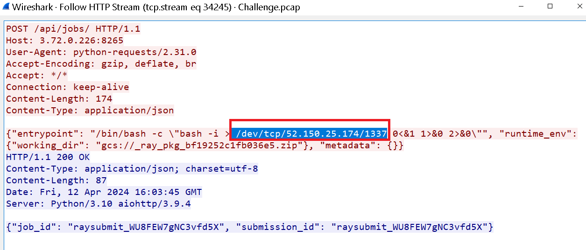

-----------

**10\. Once inside the network, the attacker started their shell from a specific directory. What is the full path from which these commands were run after the reverse shell was obtained?**

Ahora con la IP ya identificada podemos filtar por la misma y en el panel de bytes:

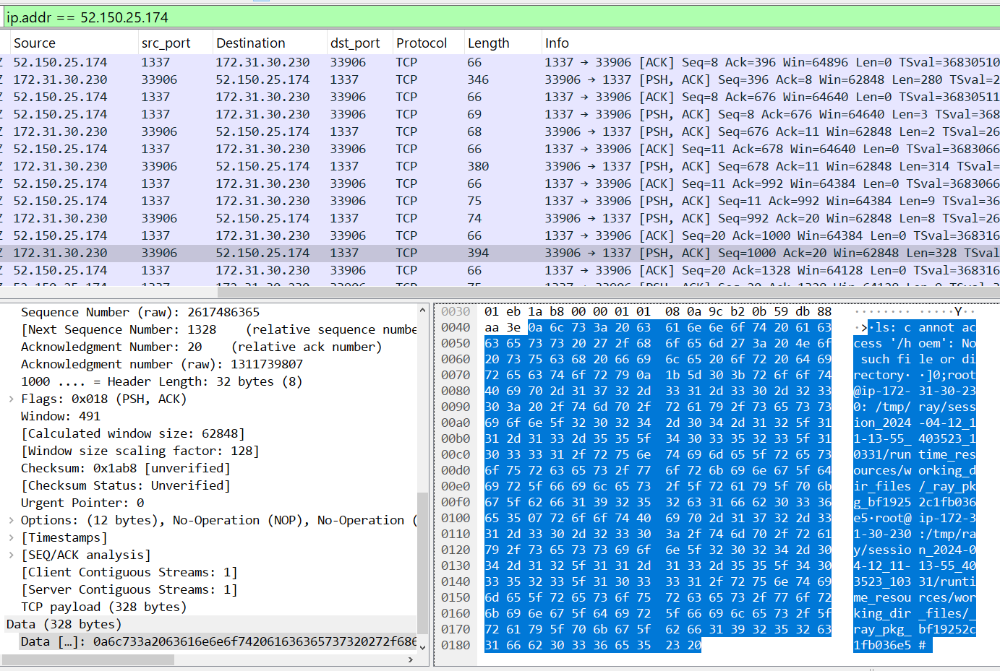

Es el formato `usuario@host:directorio#`, que es el prompt estándar de bash (la variable PS1 en la mayoría de distros Linux). Reconstruyendo el ASCII de la captura:

```bash
]0;root@ip-172-31-30-230: /tmp/ray/session_2024-04-12_11-13-55_403523_1/runtime_resources/working_dir_files/_ray_pkg_bf19252c1fb036e5
root@ip-172-31-30-230:/tmp/ray/session_2024-04-12_11-13-55_403523_1/runtime_resources/working_dir_files/_ray_pkg_bf19252c1fb036e5#
```

El `]i;...` al inicio es una secuencia de escape ANSI que cambia el título de la ventana de terminal, bash la manda junto con cada prompt.

--------

**11\. The attacker was able to exfiltrate some secrets from the victim's machine. What is the job submission ID that was created as a result?**

Continuando explorando los POST, vemos lo siguiente:

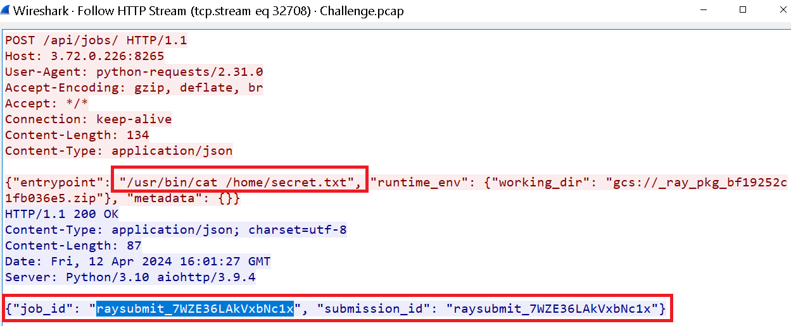

-----------

**12\. In order to successfully exfiltrate data, the attacker switched to a different IP address. What is the new IP address being used for this malicious activity?**

Como ya vimos anteriormente, tenemos 2 IP en el mismo rango:

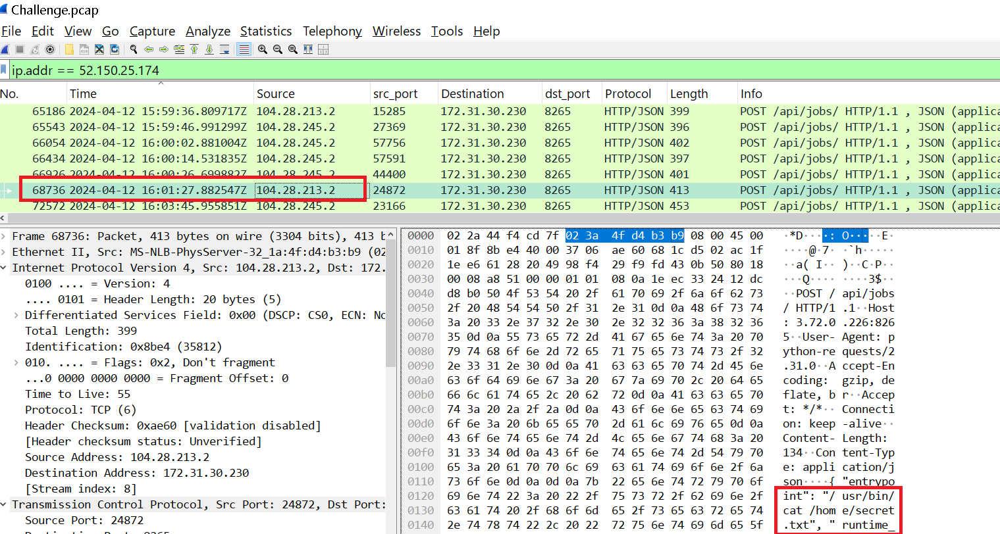

---------------

**13\. According to the investigation of the data leak, what is the content of this secret file?**

Con el filtro `frame contains "raysubmit_7WZE36LAkVxbNc1x"` empezamos a buscar entre los paquetes:

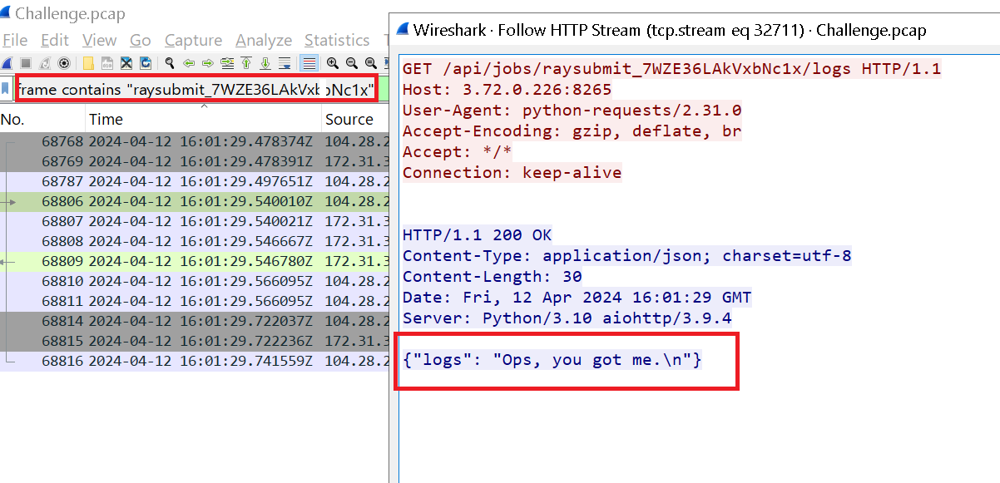

----------------

The attacker deployed a tool to brute-force open ports on your network. Analyze the traffic to determine how many packets were generated by this brute-force attempt.

Para esto podemos buscar primero por IP's que realizaron escaneos en la red:

```bash
┌──(kali㉿kali)-[~/Documents/nueva_era_sherlocks/compromisedAIcluster]
└─$ tshark -r Challenge.pcap -Y "tcp.flags.syn == 1 and tcp.flags.ack == 0" -T fields -e ip.src | sort | uniq -c | sort -rn | head -n 5
  19798 104.28.154.194
  10453 104.28.245.2
   9666 104.28.213.2
     56 212.102.54.50
     27 172.31.30.230
```

Vemos otra IP de cloudflare, la `104.28.154.194`, asì que filtrando por esta ip que lo que la pregunta pide son todos los paquetes y no solo los de escaeno:

```bash
┌──(kali㉿kali)-[~/Documents/nueva_era_sherlocks/compromisedAIcluster]
└─$ tshark -r Challenge.pcap -Y "ip.addr == 104.28.154.194" | wc -l                                                    
39598
```
