   - windows
   - dfir
   - registry-forensics
   - offline-hives
   - registry-explorer
   - regripper
   - system-hive
   - software-hive
   - sam-hive
   - controlset
   - computer-name
   - shutdown-time
   - filetime
   - little-endian
   - timezone
   - network-interfaces
   - default-gateway
   - networklist
   - user-accounts
   - last-login
   - os-version
   - autostart
   - run-keys
   - persistence
   - installed-software
   - machine-sid
   - sid-parsing
   - python
   - htb
---

**Scenario: You're a forensics analyst and have a registry dump. Try to analyze the evidence and answer the questions.**

-----

**1\. What is the Computer name of this machine?**

Esto lo encontramos en `SYSTEM\ControlSet001\Control\ComputerName\ComputerName`

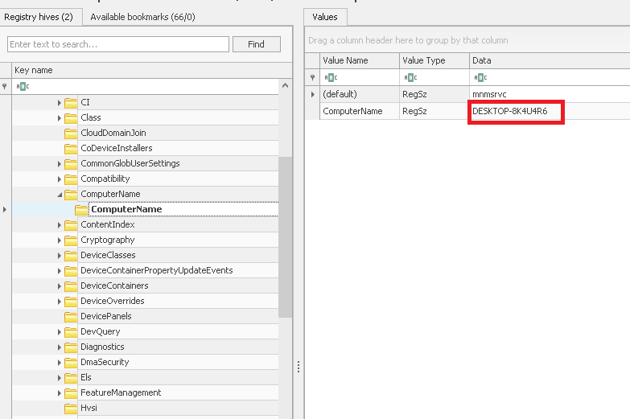

----------

**2\. **

Esto está en: `SYSTEM\ControlSet001\Control\Windows`

En `Registry Explorer` aparece en un formato de 8 bytes crudos (REG_BINARY) que forman un FILETIME de Windows en little-endian. Así que tenemos que parsear esto con RegRipper:

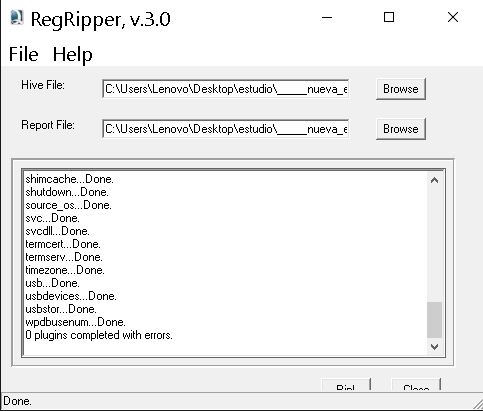

Una vez con el resultado podemos filtrar:

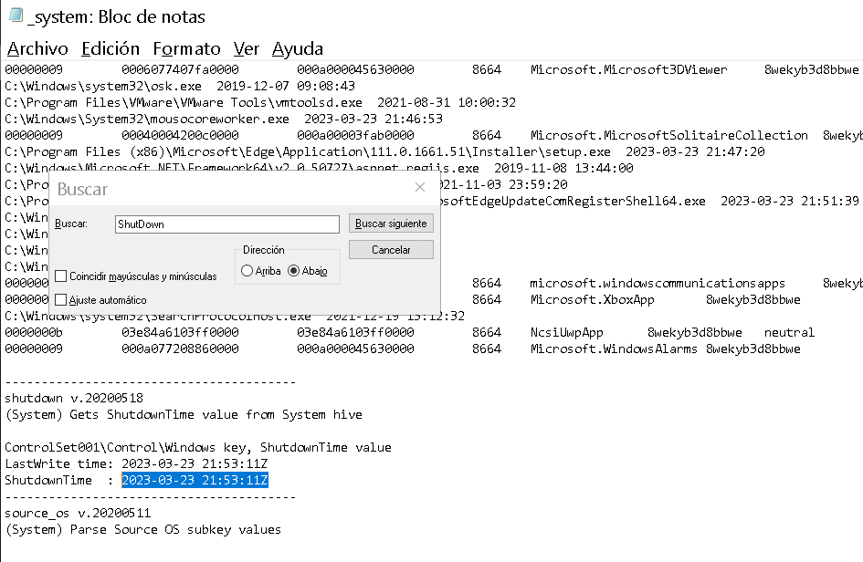

--------

**3\. What is the time zone name that the machine uses?**

Esto lo encontramos en:  `SYSTEM\ControlSet001\Control\TimeZoneInformation`

En la salida de RegRipper:

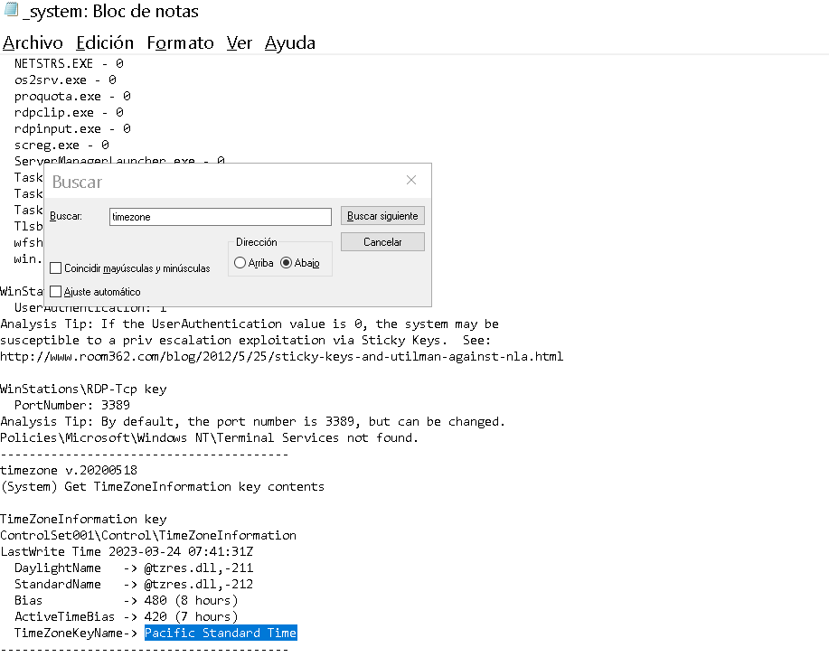

------------

**4\. What is the IP address of the default gateway?**

Esto lo encontramos en `SYSTEM\ControlSet001\Services\Tcpip\Parameters\Interfaces\{GUID}`:

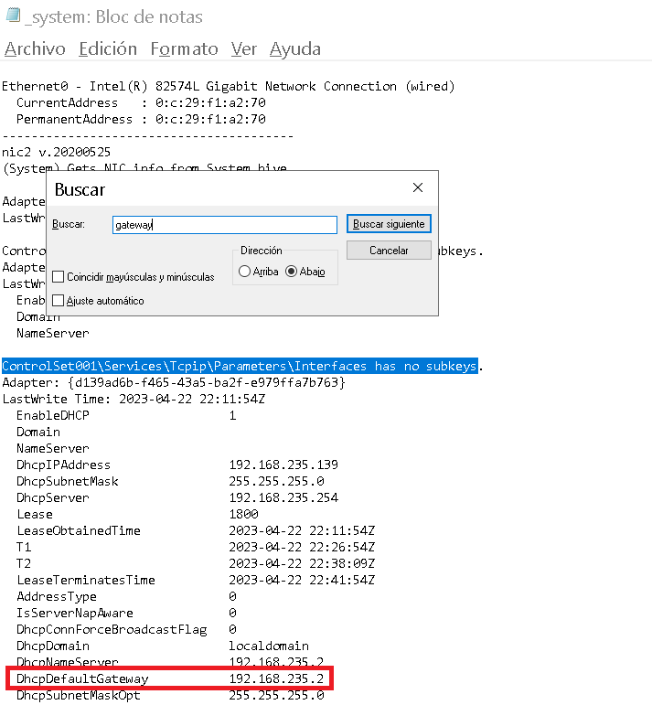

---------

**5\. What is the last login date for the user “Work”?**

Esto está en la hive SAM: `SAM\Domains\Account\Users\{RID}`

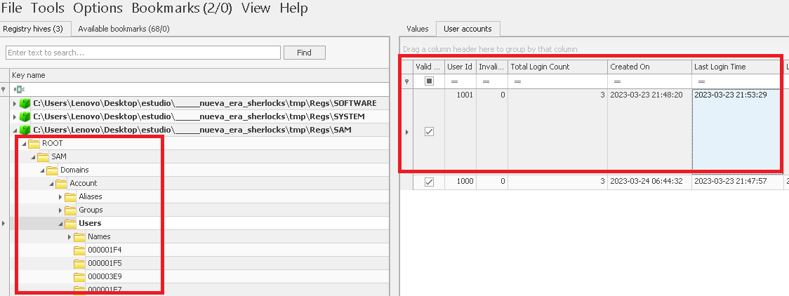

-----------

**6\. How many logins did the “Work” user have?**

En la imagen anterior vemos  que tiene `3`

-----------

**7\. What is the OS “ProductName”?**

Esto se encuentra en el hive ´SOFTWARE´: `SOFTWARE\Microsoft\Windows NT\CurrentVersion`

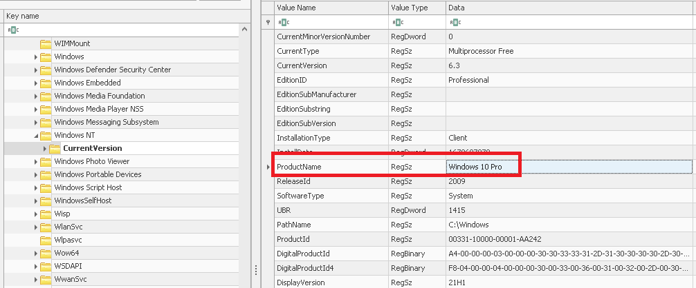

----------

**8\. What is the OS “BuildNumber”?**

También en ´SOFTWARE´: `SOFTWARE\Microsoft\Windows NT\CurrentVersion`

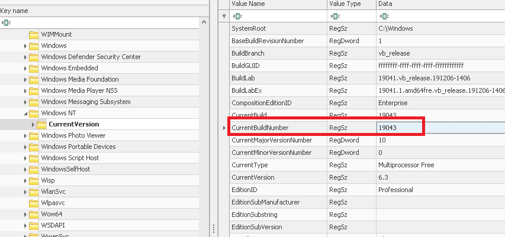

----------

**9\. How many programs run on startup for any user?**

Esto lo vemos en `Software\Microsoft\Windows\CurrentVersion\Run`:

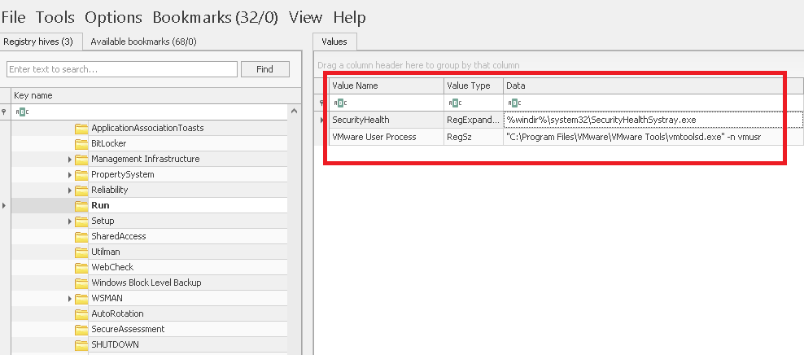

Estos programas estan configurados para ejecutarse cuando un usuario iniciara sesión.

---------

**10\. What is the last installed app?**

Esto lo vemos en `Software\Microsoft\Windows\CurrentVersion\Uninstall`:

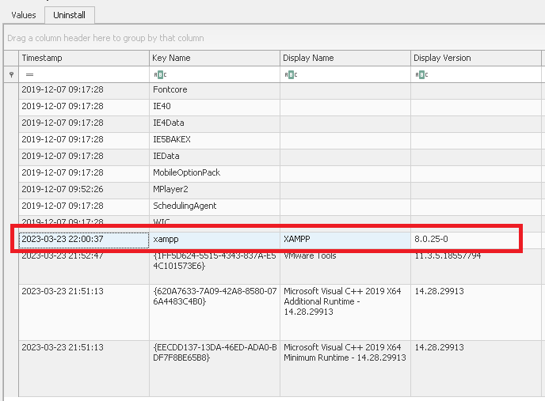

-----------

**11\. What is the “DefaultGatewayMac”?**

Esto lo vemos en la Hive de ´SOFTWARE´:

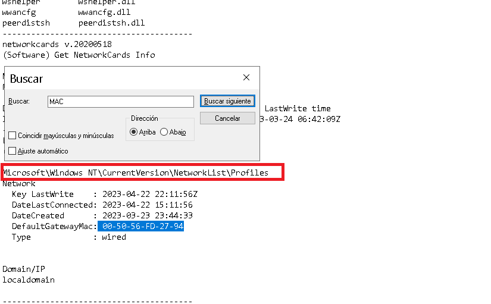

------------

**12\. What is the Machine SID?**

Esto lo encontramos en el `SYSTEM\Policy\PolAcDms`

El valor V (REG_BINARY) de esa clave termina con el SID del equipo. Los últimos 12 bytes son tres DWORD en little-endian, que corresponden a los tres números finales del SID: S-1-5-21-X-Y-Z: 

```txt
01-04-00-00-00-00-00-05-15-00-00-00-9E-E8-B1-74-9F-EF-7A-A6-02-82-1B-3E
```

Usamos el siguiente script en python para convertirlo: 

```python
import struct

# pegamos aquí los últimos 12 bytes del valor V
raw = bytes.fromhex("9EE8B1749FEF7AA602821B3E")
x, y, z = struct.unpack("<3I", raw)
print(f"S-1-5-21-{x}-{y}-{z}")
```

Ejecutando:

```powershell
PS C:\Users\User\tmp> python .\script.py                                                                              S-1-5-21-1957816478-2793074591-1041990146 
```
